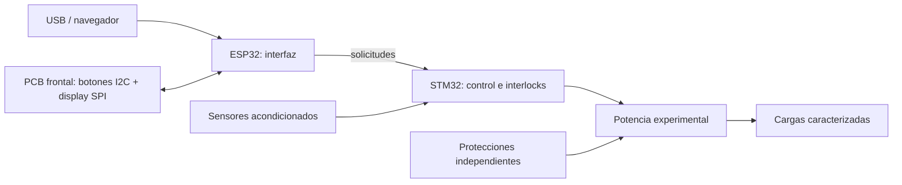

# Arquitectura Rev A

## Responsabilidades
- STM32: adquisición, límites, interlocks, estados y autoridad única sobre actuadores.
- ESP32: USB/web, configuración, telemetría y frontal; sin acceso directo a GPIO de potencia.
- STM32G431RBT6 y ESP32-S3-WROOM-1-N8R8 están instanciados en el
  [núcleo lógico preliminar](../hardware/controller/core-design.md). Hay una
  [reserva de pines](../hardware/controller/front-panel-interface.md), aún sin BSP.
- Frontal nuevo: reproduce posiciones de botones y fijaciones de la PCB original,
  con display SPI mediante adaptador reemplazable. No depende del protocolo de JP21.
  [Primer esquema](../hardware/front-panel/README.md); geometría y display exacto pendientes.
- UART entre procesadores está dibujada a 3,3 V en el mismo dominio lógico;
  velocidad, framing, temporización y ensayos siguen pendientes.
- La Rev A recibe 12 V DC aislados en J101. El manual muestra que la placa original
  recibía red en JP17 y distribuía cargas, pero eso no autoriza a unir esos dominios:
  la fuente AC/DC, potencia y aislamiento se definirán tras caracterización.
- Las referencias confirman dos cargas a 24 V DC (grupo y válvula), dos a 230 V AC
  (calentador y bomba) y el molino a 320 V DC según el modo de servicio. El borrador
  de 12 V debe revisarse y la potencia de red debe tratarse como un bloque separado.

## Núcleo actual
BOOT pasa a SAFE_IDLE con entradas simuladas válidas. Un fallo de interlocks o enlace
enclava FAULT. Todas las salidas permanecen inactivas. START siempre se rechaza;
STOP no borra FAULT. SAFE_IDLE es un estado lógico, no una garantía eléctrica.
El núcleo no incluye temporizadores, parser, HAL, GPIO, watchdog ni adquisición real.

## Estados previstos
SELF_TEST, HOMING, READY, HEATING, GRINDING, BREWING y CLEANING: pendientes de límites,
calibración y recuperación por fase. Reinicio, reconexión y actualización no deben
reanudar ciclos automáticamente. El rearme futuro requiere condiciones válidas y
acción explícita, sin eliminar la causa del fallo por software.

## Fronteras de seguridad
El BSP futuro inicializará salidas inactivas antes del runtime. Enable hardware,
watchdog y corte térmico independiente deben proteger también con MCU bloqueado.
Un semiconductor puede fallar en corto: poner un GPIO a cero no garantiza aislamiento.
USB y depuración solo serán accesibles en un dominio con separación verificada de red.
