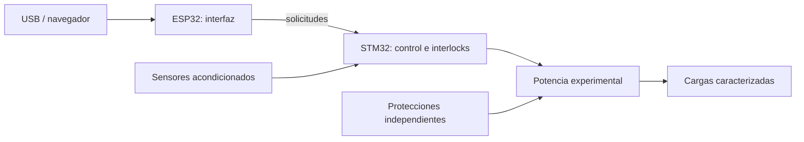

# Arquitectura Rev A

## Responsabilidades
- STM32: adquisición, límites, interlocks, estados y autoridad única sobre actuadores.
- ESP32: USB/web, configuración y telemetría; sin acceso directo a GPIO de potencia.
- STM32G4 y ESP32-S3 son candidatos. Referencias exactas, encapsulados y pines TBD.
- UART entre procesadores es una propuesta; velocidad, niveles y aislamiento TBD.
- Fuente y dominios se definirán tras caracterización. Un motor DC no implica SELV.

## Núcleo actual
BOOT pasa a SAFE_IDLE con entradas simuladas válidas. Un fallo de interlocks o enlace
enclava FAULT. Todas las salidas permanecen inactivas. START siempre se rechaza;
STOP no borra FAULT. SAFE_IDLE es un estado lógico, no una garantía eléctrica.
El núcleo no incluye temporizadores, parser, HAL, GPIO, watchdog ni adquisición real.

## Estados previstos
SELF_TEST, HOMING, READY, HEATING, GRINDING, BREWING y CLEANING: pendientes de límites,
calibración y recuperación por fase. Reinicio, reconexión y actualización no deben
reanudar ciclos automáticamente. El rearme futuro requiere condiciones válidas y
acción explícita, sin eliminar la causa del fallo por software.

## Fronteras de seguridad
El BSP futuro inicializará salidas inactivas antes del runtime. Enable hardware,
watchdog y corte térmico independiente deben proteger también con MCU bloqueado.
Un semiconductor puede fallar en corto: poner un GPIO a cero no garantiza aislamiento.
USB y depuración solo serán accesibles en un dominio con separación verificada de red.
