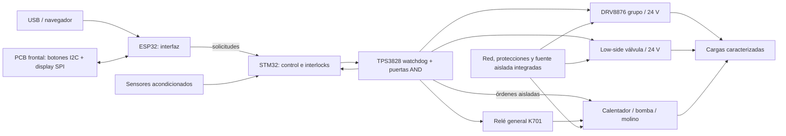

# Arquitectura Rev A

## Responsabilidades
- STM32: adquisición, límites, interlocks, estados y autoridad única sobre actuadores.
- ESP32: USB/web, configuración, telemetría y frontal; sin acceso directo a GPIO de potencia.
  El [USB-C de servicio](service-usb.md) está ya en el esquema y será la pasarela de banco.
- STM32G431RBT6 y ESP32-S3-WROOM-1U-N8R8 (antena externa U.FL) están en el
  [esquema de la principal](../hardware/controller/core-design.md), con sus pines
  asignados y ruteados; no hay BSP. Pines del ESP32 hacia el frontal en la
  [interfaz del frontal](../hardware/controller/front-panel-interface.md).
- Frontal nuevo: reproduce posiciones de botones y fijaciones de la PCB original,
  con display SPI mediante adaptador reemplazable. No depende del protocolo de JP21.
  [PCB ruteada](../hardware/front-panel/README.md) sobre la geometría recuperada;
  display de referencia ST7789 2,0" ([ADR-0001](adr/0001-front-panel-display-st7789.md)),
  MPN del panel pendiente.
- UART entre procesadores está dibujada a 3,3 V en el mismo dominio lógico;
  velocidad, framing, temporización y ensayos siguen pendientes.
- La principal recibe 230 V en JP17 e integra fusibles, varistor, la fuente
  aislada IRM-30-24, el relé general y todas las etapas de potencia, igual que la
  placa original; el filtro EMI de la Rev A es un X2 en la entrada, y el choque
  de modo común espera a medir la emisión conducida. J101 (12 V) y J112 (24 V) son
  entradas auxiliares de banco; J121 separa la fuente interna de J112.
- Las referencias confirman dos cargas a 24 V DC (grupo y válvula), dos a 230 V AC
  (calentador y bomba) y el molino a 320 V DC según el modo de servicio. El grupo
  tiene un DRV8876 y la válvula un low-side protegido, los dos desde el rail de
  24 V de la fuente integrada (o de J112 en banco). Calentador, bomba y molino
  usan triacs con optotriacs de cruce por cero tras el relé general K701. La
  [arquitectura de potencia](../hardware/power/power-architecture.md) define los
  dominios que conviven en la misma PCB sin cruzar la barrera de aislamiento.

```mermaid
flowchart LR
    U[USB / navegador] --> E[ESP32: interfaz]
    F[PCB frontal: botones I2C + display SPI] <--> E
    E -->|solicitudes| S[STM32: control e interlocks]
    I[Sensores acondicionados] --> S
    W[TPS3828 watchdog + puertas AND] --> S
    W --> G[DRV8876 grupo / 24 V]
    W --> V[Low-side válvula / 24 V]
    W --> K[Relé general K701]
    S --> W
    W -->|órdenes aisladas| P[Calentador / bomba / molino]
    K --> P
    G --> C[Cargas caracterizadas]
    V --> C
    P --> C[Cargas caracterizadas]
    H[Red, protecciones y fuente aislada integradas] --> P
    H --> G
    H --> V
```

## Núcleo actual
BOOT pasa a SAFE_IDLE con entradas simuladas válidas. Un fallo de interlocks o enlace
enclava FAULT. Todas las salidas permanecen inactivas. START siempre se rechaza;
STOP no borra FAULT. SAFE_IDLE es un estado lógico, no una garantía eléctrica.
El núcleo de firmware no incluye temporizadores, parser, HAL, GPIO, servicio del
watchdog ni adquisición real. El watchdog hardware ya existe en el esquema.

## Estados previstos
SELF_TEST, HOMING, READY, HEATING, GRINDING, BREWING y CLEANING: pendientes de límites,
calibración y recuperación por fase. Reinicio, reconexión y actualización no deben
reanudar ciclos automáticamente. El rearme futuro requiere condiciones válidas y
acción explícita, sin eliminar la causa del fallo por software.

## Fronteras de seguridad
El BSP futuro inicializará salidas inactivas antes del runtime. El TPS3828 y las
puertas AND U602–U604 anulan con el MCU en reset las órdenes de grupo, válvula,
calentador, bomba, molinillo y relé general. Los termostatos de la caldera siguen
siendo el corte térmico independiente.
Un semiconductor puede fallar en corto: poner un GPIO a cero no garantiza aislamiento.
USB y depuración solo serán accesibles en el dominio SELV, con separación
verificada respecto de red y del bus rectificado del molino.
