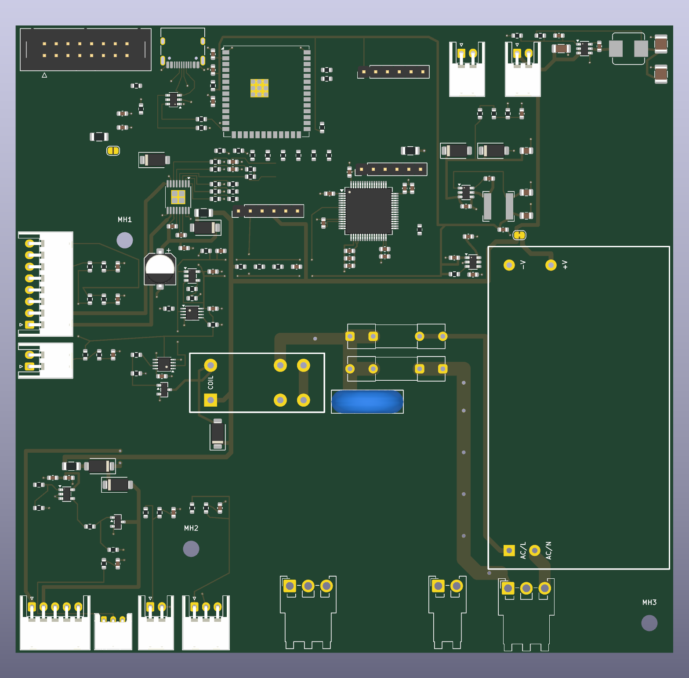
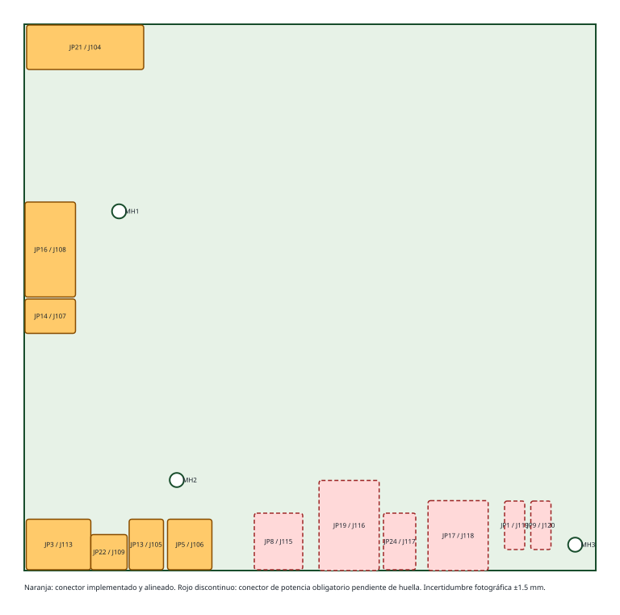

# Colocación de la principal Rev A

Estado: colocación mecánica de conectores y colocación funcional con la
distribución de la placa original, dominio de red contiguo, reserva del disipador
y barrera red/SELV comprobada por DRC. El puente H, el supervisor y sus
interlocks, la válvula, los sensores y el buck de 12 V ya están ruteados a mano;
aún no fabricable. La fuente de verdad mecánica es
`mechanical-source.json`; `tools/layout_controller_pcb.py` consume sus
coordenadas, coloca las 156 huellas actuales y comprueba que los tres taladros aceptados
no se muevan.

## Sustitución física de la placa original

La posición de los mazos ya no se decide por conveniencia eléctrica. Se ha
rectificado IMG_1098 con el contorno aceptado de 141,6 × 135,2 mm y se ha usado
IMG_1101 para confirmar el sentido de entrada lateral. Se fija esta relación:

| Original | Rev A | Borde | Origen de huella X/Y (mm) | Giro |
|---|---|---|---:|---:|
| JP21 | J104, enlace del frontal nuevo | superior | 6,2 / 6,5 | 90° |
| JP16 | J108, grupo y micros | izquierdo | 3,0 / 64,5 | 90° |
| JP14 | J107, puerta/cajón | izquierdo | 3,0 / 73,5 | 90° |
| JP3 | J113, electroválvula | inferior | 3,5 / 125,3 | 0° |
| JP22 | J109, nivel de agua | inferior | 19,0 / 128,2 | 0° |
| JP13 | J105, NTC | inferior | 29,0 / 125,3 | 0° |
| JP5 | J106, caudalímetro | inferior | 38,5 / 125,3 | 0° |

La incertidumbre de posición asignada es ±1,5 mm. J104 ocupa la zona de JP21,
pero no reproduce su interfaz: el IDC 2×8 nuevo es algo más ancho y enlaza con la
nueva placa frontal. J110 queda inmediatamente a su derecha, accesible desde el
mismo borde superior para las pruebas por ordenador.

JP8, JP19, JP24, JP17 y los dos FASTON de tierra son conectores obligatorios de
la principal completa. JP8, JP24 y JP17 ya tienen huella; las envolventes de
JP19 y los FASTON se protegen mediante áreas de regla hasta cerrar su geometría.
No son reservas para otra placa: forman parte de esta misma PCB de sustitución.

## Zonas funcionales

La distribución sigue la de la placa original: lógica arriba y a la izquierda,
red en el cuadrante inferior central y derecho, y el disipador de las cargas
encima de JP8/JP19/JP24.

- Borde superior izquierdo: enlace al frontal en la zona de JP21, USB-C a su
  derecha con la protección ESD, y el ESP32-S3-WROOM-1U junto a ambos. El
  conector U.FL del módulo queda arriba, hacia el borde.
- Superior central: STM32 con su desacoplo, reset y SWD, y debajo J114, F303/D304,
  el divisor de 24 V y las series del LCD. Más a la derecha, el buck de 3,3 V y el
  corte del frontal.
- Esquina superior derecha: entradas de banco J101/J112, buck AP63200 de 24 V a
  12 V y, debajo, el puente H DRV8876 con su columna de fallo, VREF e IPROPI.
- Lateral izquierdo: JP16 y JP14 en sus zonas originales, sus filtros, las
  cabeceras de depuración, el watchdog e interlock (U601/U602) y el mando del
  relé (U603, Q701, D701).
- Borde inferior izquierdo: JP3, JP22, JP13 y JP5 con su acondicionamiento y la
  etapa de válvula, en el mismo orden y sentido que en la original.
- Dominio de red, por debajo y a la derecha de la barrera: K701 con los contactos
  a la derecha de la barrera; F701, F702 y RV701 encima del disipador; y PS701 en
  vertical en el borde derecho, con las salidas de 24 V arriba (SELV) y los pines
  AC abajo, junto a J118. El paso de 6 mm entre el disipador y PS701 lleva L y
  PSU_L entre J118, los fusibles y PS701.
- Borde inferior central y derecho: conectores originales de potencia y las
  envolventes aún pendientes de JP19 y de los dos FASTON de protección.

USB, frontal, sensores, STM32, ESP32 y depuración permanecen íntegramente en
SELV. Las órdenes hacia las cargas de red cruzarán la frontera únicamente por
componentes de aislamiento y ningún plano de masa la atravesará.

## Barrera red/SELV verificable

La clase `Mains` agrupa L, N, fase tras fusibles y relé, bomba y bus del
molinillo. `controller-core-reva.kicad_dru` exige 8 mm de separación y de
creepage entre cualquier cobre `Mains` y cualquier red SELV, y 2,5 mm entre
pistas de redes `Mains` distintas. La separación de clase entre pads de red se
queda en 1,2 mm porque la fija el paso de 3,96 mm de los VH originales. Los
pines sin uso de conectores de red y los taladros sin red no cuentan como SELV.

`layout_controller_pcb.py` fija además la línea central de la barrera
(`MAINS_BARRIER`), que es una L: sube desde el borde inferior en x = 51 mm, entre
J106 y J115, hasta y = 60 mm, y cruza hacia el borde derecho por encima de
PS701. Alrededor de ella hay una banda de 8 mm en ambas capas sin pistas, vías,
pads ni rellenos. K701, PS701 y los futuros optoacopladores pueden atravesarla
porque su propio aislamiento cubre ese tramo. Un opto DIP-6 estándar tiene las
filas a 7,62 mm y el DRC lo rechazará: hará falta una versión de patillas anchas
o una ranura.

La primera versión de la regla detectó 95 infracciones en la colocación inicial:
fusibles junto al puente H, contactos de K701 entre la lógica y el bus del
molinillo junto al buck de 12 V. La colocación actual no tiene ninguna.

## Disipador de calentador y bomba

El disipador original (IMG_1098, IMG_1100 e IMG_1101) es un perfil de pie de
40 mm de ancho y 35 mm de alto, con un TO-220 en cada canal, pegado justo detrás
de AC_LOADS (JP19). Se reserva el mismo sitio: `HEATSINK_AREA` (x = 55–95,
y = 84,5–113 mm), como un área de regla que solo prohíbe huellas. Se toma un
fondo de 28,5 mm, el espacio entre la fila de K701/RV701 y la carcasa de JP19;
los 33 mm leídos en la foto cenital incluyen las aletas abiertas de arriba.
JP19 mide 22 × 15 × 13 mm, con 4 lengüetas FASTON 6,3 × 0,8 mm a 5 mm de paso
(medidas del propietario). Su envolvente pendiente es de 15 × 22 mm, a ras del
borde inferior, hasta conocer cuánto sobresale y el patrón de patas. Por eso se
cambió el ESP32 por la variante 1U de antena externa: la zona de exclusión de
la antena impresa ocupaba unos 1 990 mm², el 10 % de la placa, y sin ese espacio
no cabían a la vez el disipador, los fusibles, el MOV y K701.

El triac del molinillo irá en TO-220 de pie sin disipador, como el BTA208 de la
original, tras comprobar su pérdida. Su puente rectificador, los optos y los
snubbers ocuparán el hueco entre K701/RV701 y el disipador y el paso junto a
PS701.

## Routing del STM32

Todo el bloque del STM32 se desplaza junto con U101: la colocación lo define
respecto a `U101_AT` y el routing aplica a sus pistas el desplazamiento de U101.
Cada VSS baja al plano con su propia vía dentro del anillo de pads. Los VDD
(1/64, 13, 19/20, 32 y 48) se unen mediante un anillo de 3V3 en F.Cu bajo el
cuerpo del LQFP, y cada par VDD/VSS tiene su condensador fuera, en una esquina o
junto al par: C105/C111 arriba a la izquierda, C102 a la izquierda, C104 con el
bulk C106 arriba a la derecha, C103/C110 abajo a la derecha y la columna
C107/C109/C108 de VDDA/VREF+ bajo los pines 18–20.

Canales reservados para las señales:

- pines 7–10 (NRST y contactos): salida horizontal a la izquierda;
- pines 14–17 (NTC, caudal, nivel, corriente del grupo): en L escalonadas hacia
  abajo, a 6,3–7,8 mm a la izquierda del centro de U101;
- pines 21–24 y 27: hacia abajo, a la derecha de la columna de VDDA;
- pines 42–44: a la derecha;
- pines 49–61 (SWD, watchdog, armado y BOOT0): hacia arriba.

El plano GND_UI de B.Cu cubre el lado SELV hasta el borde de la banda de
barrera; además, el filler lo aparta 8 mm de todo cobre de red.

## USB

El puerto (J110 → U203) conserva su fanout. Del lado del dispositivo, la pareja
rodea U203 por la izquierda hasta R221/R222 y llega a los pads 13/14 del ESP32,
a unos 15 mm. Como sale de U203 en sentido opuesto al módulo, DM cruza una vez a
DP por B.Cu justo antes de los pads.

## Entrada de red

- Fase: J118.1 sube por el paso entre el disipador y PS701 hasta F701 (3 mm en
  cada cara). PSU_L baja desde F702 por el mismo paso hasta PS701.1 (1 mm). Las dos
  pistas van anidadas y separadas 2,5 mm; por eso F702 está encima de F701.
- Fase protegida: une las dos pinzas de F701 y F702, RV701 y los dos pads COM
  de K701. El par COM de K701 se une por B.Cu para dejar sitio a la unión del par
  NO (`LOAD_L_ENABLED`), que espera a las etapas de carga.
- Neutro: J118.3 → PS701.2 en F.Cu y, desde ahí, hasta RV701 por B.Cu, por
  debajo de las dos fases. En el lado de red no hay plano, así que B.Cu está libre.
- Todo el cobre de red mantiene 2,5 mm entre redes distintas y 8 mm hasta SELV,
  comprobados por el DRC. La salida de J118.1 se estrecha a 2,2 mm para respetar
  1,2 mm hasta el pin central libre del VH.

Las fases que llevan la corriente de carga (unos 10 A) van duplicadas: 3 mm en
F.Cu y 3 mm en B.Cu, unidas por pads THT y vías de cosido de 1,6/0,8 mm. Son unos
6 mm de cobre de 1 oz, frente a los ≈4,7 mm que pide IPC-2221 para 10 A con 20 °C
de calentamiento. Se decidió así el 2026-09-19 porque sale más barato en JLCPCB
que pasar a 2 oz. El tramo corto que une las pinzas de F701 y la curva superior,
unos 10 mm, quedan solo en F.Cu, porque el neutro cruza por B.Cu justo encima.

## Salida de 24 V

- PS701.4 → J121 (`24V_INTERNAL_RAW`), junto al extremo SELV del módulo.
- `24V_ACT_RAW` sale de J121 por dos caminos:
  - un carril de 0,8 mm en x = 107,85 mm, entre el buck de 3,3 V y las
    resistencias del DRV8876, hasta J112 y el buck de 12 V;
  - una troncal de 1 mm por el borde SELV de la banda de barrera (y = 55,1 mm)
    que baja por x = 46 mm, a la izquierda de la banda. De ella salen F303
    (rama del grupo), el divisor R704, J114.4, la bobina de K701, D701 y la
    rama de la válvula (F304).
- Para esos recorridos se giró J121 y se movieron C307 y Q701.

## Validación

- 156/159 huellas eléctricas colocadas; J115/JP8, J117/JP24 y J118/JP17 ocupan
  ya sus zonas originales. Faltan las huellas de JP19, JP1 y JP9. Contorno
  141,6 × 135,2 mm y MH1–MH3 preservados.
- DRC KiCad 10.0.6 con todas las severidades: 0 infracciones, incluidas la
  barrera de 8 mm, la reserva del disipador y los solapes de courtyard.
- 547 segmentos y 119 vías. 1 884 mm de pista en F.Cu y 288 mm en B.Cu, casi
  todo el cruce del par USB y los dos saltos cortos bajo troncales de potencia.
  La impedancia USB se verificará con el stack-up real antes de fabricar.
- 85 conexiones sin rutear y seis diferencias de paridad: los tres taladros
  mecánicos intencionales y los tres conectores aún sin huella.
- Dos avisos de extremo suelto, intencionales: las filas de fallo y de corriente
  del puente H terminan donde entrarán las señales del STM32.

Las referencias se dejan temporalmente en `F.Fab` para que la colocación densa no
genere conflictos de serigrafía. Se añadirán identificadores legibles de
conectores, polaridad, puntos de medida y seguridad después del routing.

## Bloques ruteados a mano

El plan acordado el 2026-09-19 se ha ejecutado y ampliado. Cada bloque está
escrito en `route_controller_pcb.py` y se comprueba con DRC completo después de
añadirlo.

### Puente H del grupo

U501 se ha girado 270° y llevado al hueco que dejó J102, encima de MH1 y junto a
JP16 (centro 35/37 mm). Debajo quedan la bomba de carga (C503/C504), el bulk
C501 y el desacoplo C502; F303 y D304 entran en el mismo bloque. Las seis
señales de control salen en filas de 1,6 mm hacia el este, cada pareja
serie/pull-down unida por un salto sobre el pad de masa. OUT1 y OUT2, de 0,8 mm,
bajan por la izquierda a x = 28 y 29,2 mm y entran en J108 a y = 62 y 64,5 mm,
entre las filas de filtros. El pad expuesto baja al plano por cuatro vías.

J102 y J103 ya no están en el hueco del puente H ni en la esquina superior
derecha: J102 queda justo encima del STM32 (74,5/31 mm), en la salida natural de
los pines 49–61, y J103 al lado del ESP32 (75/10 mm), cerca de sus pines de
depuración.

### Supervisor, interlocks y mando del relé

R601 y R602 se han metido debajo de U601 para dejar libre el canal entre los
integrados y la columna de condensadores; por él sube la espina de 3V3 que
alimenta U601, C601, U602 y C602. El canal de 1,35 mm que queda al oeste de
U601/U602, entre ellos y C501, se deja vacío a propósito: es el único acceso a
los pines de STM_NRST y a las órdenes en bruto, y se rutea en la pasada de
señales. Por eso este bloque deja abiertos esos pines en lugar de taparlos.

U603 se ha girado 180° para que su salida mire a las resistencias de puerta. La
cadena del relé va de U603 a R801, R802 y Q701, y de ahí a la bobina de K701 y
al diodo D701. El retorno de bobina pasa al oeste de los pines de bobina, porque
el corredor este lo ocupa la alimentación de 24 V de K701.1.

U603 no tenía condensador de desacoplo propio. Se ha añadido C603, un 100 nF
igual que C601 y C602, entre U603 y Q701: la puerta que arma la red no debe
tomar una caída de alimentación por un nivel alto válido.

### Válvula

F304, D305, D306, U502, Q501 y sus resistencias están ruteados. El par de 24 V y
el retorno conmutado bajan por el borde izquierdo y por y = 121 mm hasta JP3,
de modo que la cadena de puerta no tiene que cruzarlos. La rama de 24 V baja a
B.Cu durante 2,6 mm para pasar por debajo de la troncal de 24 V de y = 93 mm;
el plano pierde solo esa ranura.

### Sensores

NTC, caudalímetro, nivel de agua, puerta y los dos contactos del grupo llegan
desde sus conectores a sus filas de pull-up, serie y filtro. Los pines 3 y 4 de
JP16 quedan puenteados. El contacto de trabajo sube por el este de MH1 y C501
para no cruzar la fila del contacto de presencia. Cada condensador de filtro
baja al plano por su propia vía.

### Buck de 24 V a 12 V

Nodo de conmutación corto entre U303, C313 y L302; banco de salida al otro lado
de la bobina. Los dos condensadores 1210 comparten la columna x = 139 mm con un
pad de masa entre medias, así que el raíl los rodea por dentro, a x = 136 mm.

El divisor de realimentación estaba debajo del conmutador, a y = 10 mm, y desde
ahí no tenía camino: la troncal de 24 V rodea C310 por y = 7,3 mm para llegar a
los pines de entrada, y el único hueco que quedaba era el canal de 0,95 mm por
debajo del integrado, entre sus pads de entrada y el nodo de conmutación. Se ha
movido R302, R303 y C314 al borde superior, al noroeste del conmutador. Ahora
una sola línea a y = 3,4 mm recoge las tres piezas y entra en el pin 1 sin
cruzarse con nada, porque la troncal se mantiene a y ≥ 5 mm en todo su rodeo a
C310. El extremo alto del divisor vuelve al pad de la bobina por una línea de
sensado, sin corriente, pegada al borde superior.

### Buck de 12 V a 3,3 V

C302, el condensador de entrada de alta frecuencia, estaba a 8 mm del
conmutador, junto al bulk C301. Se ha llevado debajo del encapsulado, puenteando
los pines de entrada con el de masa, que es donde cierra el lazo que conmuta. La
masa del conmutador llega al plano a través del pad de ese condensador, así que
el lazo se cierra en cobre antes de pasar por una vía.

12V_FUSED cruza por encima de D301 y 12V_PROTECTED sale por debajo, de modo que
sobre los pads de los diodos no pasa ninguna pista ajena. La línea de sensado de
3,3 V vuelve al pin 1 por el norte del conmutador, a y = 31,5 mm, por encima del
nodo de conmutación y del arranque.

La troncal de 24 V subía a x = 107,85 mm, justo entre la bobina y la columna de
condensadores de salida, así que todos los enlaces de 3,3 V la cruzaban. Se ha
llevado a la columna vacía de x = 112,5 mm, al este de esos condensadores, y
baja a J112 por un ramal corto. Los condensadores de salida se quedan junto a la
bobina, que es donde deben estar.

La telemetría de 12 V queda ruteada: R702 girado 270° para que el nodo medio
mire a R701 y el nodo filtrado siga en línea recta hasta R703 y C701.

### Corte del frontal

La huella de PS701 cierra este hueco por el este a x = 101,25 mm, así que todo
lo que estaba al este de U302 se ha pasado al oeste o al norte. C307, que fija
el tiempo de subida, estaba a 8 mm de su pin 4 y ahora está pegado a él; C308
desacopla la entrada junto al pin 1 y C309 sostiene la salida conmutada. El raíl
de 3,3 V entra al hueco por y = 43 mm y baja por la columna libre de
x = 91,6 mm, al oeste de la pila de condensadores.

### Distribución de 3,3 V

Una sola línea sale del buck por y = 43 mm y se parte en dos.

La rama norte sube por el hueco de 1,1 mm que queda entre F301 y D301, cruza por
encima del ESP32 a y = 2,5 mm y baja a sus pines de alimentación, a sus dos
resistencias de estado y a la cabecera de UART. Para dejarle ese hueco libre,
F301 se ha movido 3 mm al oeste y el enlace de 12 V fusionado pasa por debajo
del cuerpo de D301 en B.Cu en vez de rodearlo por arriba. De la misma rama
cuelgan el pull-up de reset del STM32 y la cabecera SWD.

La rama oeste corre por el hueco de 1,1 mm entre los condensadores del
supervisor y la troncal de 24 V que pasa por debajo. Dos ramales de 24 V suben
cruzando su camino, el de x = 46,4 mm hacia el fusible del grupo y el de
x = 62,5 mm hacia la cabecera de medida, así que pasa por debajo de cada uno en
B.Cu. De ella salen la cabecera de medida, el bloque del supervisor, la puerta
que arma la red y, tras otro salto bajo las dos salidas del motor, los pull-up
de los contactos y el de la puerta.

R405 se ha girado 270° para que su pad de 3,3 V mire al norte: la red del mazo
de la puerta ocupa el carril de y = 71,8 mm y no dejaba alimentarlo por abajo.

Siguen sin alimentar los pull-up de la fila inferior (NTC y caudalímetro), J109
y las resistencias de fallo y VREF del puente H. Los primeros necesitan cruzar
el ramal de 24 V de la válvula, que atraviesa la placa a y = 93 mm; las
segundas están encerradas entre las envolventes de fallo y de corriente.

### Árbol de reset

R101 y C101 estaban al este del STM32, pero su pin de reset es el 7, del lado
oeste, así que la pareja se ha llevado al propio carril del reset, junto al
supervisor que lo gobierna. El pin sale en horizontal, porque los pads del oeste
van a 0,5 mm de paso y cualquier diagonal toca el vecino, baja a y = 50,5 mm y
cruza hacia el oeste por debajo de los dos ramales de 24 V hasta el canal de
1,35 mm que se había dejado libre junto a C501. De ahí alimenta U601, U602 y
U603.

Quedan dos puntos de reset abiertos. El pin 6 de U602, su segunda entrada, solo
se puede alcanzar por el hueco de 0,87 mm al este del encapsulado, que ya usan
la orden de la válvula y el ramal de 3,3 V. Y el pin de reset de la cabecera
SWD, que tendría que cruzar el enlace de desacoplo que pasa por el norte del
microcontrolador. Ninguno de los dos impide depurar ni arrancar.

## Verificación de huellas

Se comprobó contra la hoja de datos que el SN74LVC2G08 en encapsulado DCT lleva
2Y en el pin 3, GND en el 4, 2A en el 5 y 2B en el 6. No coincide con el DCU de
ocho patillas, que sería 2A en el 3, 2B en el 5 y 2Y en el 6. El símbolo del
generador usa la asignación DCT, que es la correcta para el SN74LVC2G08DCTR
elegido. Si alguna vez se sustituye por la variante DCU, hay que cambiar también
el símbolo.

## Siguiente paso

1. Cerrar la distribución de 3,3 V: fila inferior de sensores, J109 y las
   resistencias de fallo y VREF del puente H. Y el raíl de 12 V desde el buck
   hasta J101 y F301.
2. Señales del STM32 por los canales reservados, empezando por STM_NRST y las
   órdenes en bruto que esperan en el canal oeste del supervisor.
3. Etapas de calentador, bomba y molinillo, que siguen esperando al disipador y
   a las huellas de JP19/JP1/JP9.

Se probó Freerouting (`tools/autoroute_controller_pcb.py`, experimental y no
usado por la cadena). No dejó infracciones de separación, pero puso 2,3 m de
pista y 220 vías en B.Cu, troceó el plano de GND, estrechó pistas a 0,15 mm y no
consiguió rutear el puente H. Se descartó a favor del ruteo manual.

Las etapas de calentador, bomba y molinillo esperan a elegir el disipador y a
las huellas de JP19/JP1/JP9. No se generarán Gerbers mientras queden conexiones
abiertas o la revisión de aislamiento pendiente.
