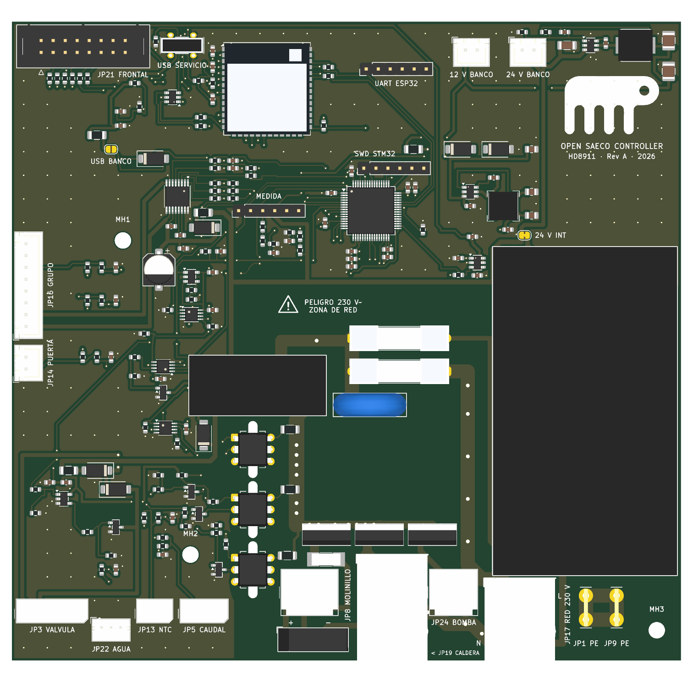
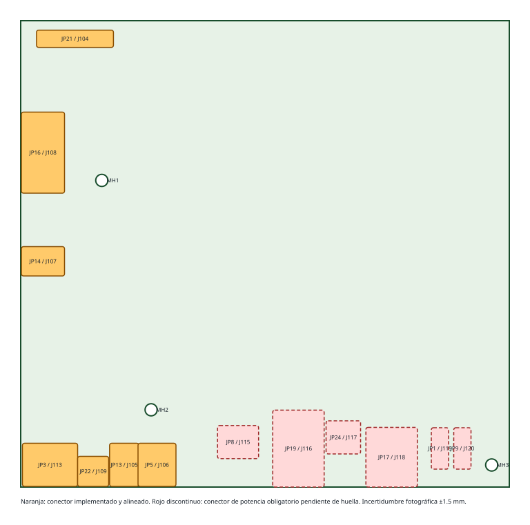

# Colocación de la principal Rev A

Estado: colocación mecánica de conectores y colocación funcional con la
distribución de la placa original, dominio de red contiguo, reserva del disipador
y barrera red/SELV comprobada por DRC. Desde el 2026-09-23 la placa es de
cuatro capas y todas las redes están ruteadas a mano: DRC sin infracciones ni
conexiones abiertas. Tiene rellenos de masa en el lado SELV y serigrafía. Faltan
la comprobación 1:1 y la revisión de aislamiento. Aún no fabricable. La fuente
de verdad mecánica es `mechanical-source.json`; `tools/layout_controller_pcb.py`
consume sus coordenadas, coloca las 187 huellas eléctricas y comprueba que los
tres taladros aceptados no se muevan.

Los cuerpos del relé, la IRM-30, el ESP32-S3-1U, los conectores de mazo y otras
piezas sin modelo en KiCad son [sustitutos simplificados](kicad/OpenSaeco.3dshapes/README.md):
la vista sirve para orientarse, no para medir alturas.

## Sustitución física de la placa original

La posición de los mazos ya no se decide por conveniencia eléctrica. Se ha
rectificado IMG_1098 con el contorno aceptado de 141,6 × 135,2 mm y se ha usado
IMG_1101 para confirmar el sentido de entrada lateral. Se fija esta relación:

| Original | Rev A | Borde | Origen de huella X/Y (mm) | Giro |
|---|---|---|---:|---:|
| JP21 | J104, enlace del frontal nuevo | superior | 6,2 / 6,5 | 180° |
| JP16 | J108, grupo y micros | izquierdo | 3,0 / 64,5 | 90° |
| JP14 | J107, puerta/cajón | izquierdo | 3,0 / 73,5 | 90° |
| JP3 | J113, electroválvula | inferior | 3,5 / 125,3 | 0° |
| JP22 | J109, nivel de agua | inferior | 19,0 / 128,2 | 0° |
| JP13 | J105, NTC | inferior | 28,75 / 125,3 | 0° |
| JP5 | J106, caudalímetro | inferior | 37,0 / 125,3 | 0° |

Desde el 2026-10-06 J106 está 1,2 mm más al oeste y J105 0,25 mm, con el
acuerdo del propietario, para que U704 quepa en la barrera (ver «Corriente del
molinillo»). J106 queda a 1,5 mm de la foto, dentro de la incertidumbre.

La incertidumbre de posición asignada es ±1,5 mm. J104 ocupa la zona de JP21,
pero no reproduce su interfaz: desde el 2026-10-01 es el Würth WR-MM 690367181672
(ver «JP21: Würth WR-MM»), con pinout nuevo, y enlaza con la
nueva placa frontal. J110 queda inmediatamente a su derecha, accesible desde el
mismo borde superior para las pruebas por ordenador.

Todos los conectores de mazo entran en vertical (decisión del propietario,
2026-09-22). J101, J105–J109, J112–J113, J115, J117 y J118 pasan de las JST
S-series laterales a las B-series verticales. Los pads, el paso y el taladro eran
los mismos, así que las huellas conservaron origen y giro y el cobre no cambió.
Desde el 2026-09-29 J105, J106, J113, J115 y J117 llevan las cabeceras
identificadas por el propietario (ver «JP3, JP5, JP13, JP8 y JP24»).
J118 bajó entonces 0,8 mm para despejar PS701; desde el 2026-09-24 ya no es un
VH sino el TE 1971845-3 de tres vías (ver «JP17»). Los courtyards liberan unos 750 mm². La franja útil está
en x = 7–12,7 mm junto a J107/J108 y en y = 10–15,7 mm bajo J101/J112. En la fila
inferior se libera y ≈ 129–135 mm junto al borde. J110 (USB-C) también pasa a
vertical, con el HRO TYPE-C-31-D-06 (ver «USB»). J102–J104, J114, J116 y los
FASTON ya eran verticales.

JP8, JP19, JP24, JP17 y los dos FASTON de tierra son conectores obligatorios de
la principal completa, y ya tienen huella los seis. No son reservas para otra
placa: forman parte de esta misma PCB de sustitución.

## Zonas funcionales

La distribución sigue la de la placa original: lógica arriba y a la izquierda,
red en el cuadrante inferior central y derecho, y el disipador de las cargas
encima de JP8/JP19/JP24.

- Borde superior izquierdo: enlace al frontal en la zona de JP21, USB-C a su
  derecha con la protección ESD, y el ESP32-S3-WROOM-1U junto a ambos. El
  conector U.FL del módulo queda arriba, hacia el borde.
- Superior central: STM32 con su desacoplo, reset y SWD, y debajo J114, F303/D304,
  el divisor de 24 V y las series del LCD. Más a la derecha, el buck de 3,3 V y el
  corte del frontal.
- Esquina superior derecha: entradas de banco J101/J112, buck AP63200 de 24 V a
  12 V y, debajo, el puente H DRV8876 con su columna de fallo, VREF e IPROPI.
- Lateral izquierdo: JP16 y JP14 en sus zonas originales, sus filtros, las
  cabeceras de depuración, el watchdog e interlock (U601/U602) y el mando del
  relé (U603, Q701, D701).
- Borde inferior izquierdo: JP3, JP22, JP13 y JP5 con su acondicionamiento y la
  etapa de válvula, en el mismo orden y sentido que en la original.
- Dominio de red, por debajo y a la derecha de la barrera: K701 con los contactos
  a la derecha de la barrera; F701, F702 y RV701 encima del disipador; y PS701 en
  vertical en el borde derecho, con las salidas de 24 V arriba (SELV) y los pines
  AC abajo, junto a J118. El paso de 6 mm entre el disipador y PS701 lleva L y
  PSU_L entre J118, los fusibles y PS701.
- Borde inferior central y derecho: conectores originales de potencia, JP19
  (TE 1971845-4) y los dos FASTON de protección.

USB, frontal, sensores, STM32, ESP32 y depuración permanecen íntegramente en
SELV. Las órdenes hacia las cargas de red cruzan la frontera únicamente por
los optotriacs y ningún plano de masa la atraviesa.

## Barrera red/SELV verificable

La clase `Mains` agrupa L, N, fase tras fusibles y relé, bomba y bus del
molinillo. `controller-core-reva.kicad_dru` exige 8 mm de separación y de
creepage entre cualquier cobre `Mains` y cualquier red SELV, y 2,5 mm entre
pistas de redes `Mains` distintas. La separación de clase entre pads de red se
queda en 1,2 mm porque la fija el paso de 3,96 mm de la cabecera de JP8. Los
pines sin uso de conectores de red y los taladros sin red no cuentan como SELV.

`layout_controller_pcb.py` fija además la línea central de la barrera
(`MAINS_BARRIER`), que es una L: sube desde el borde inferior en x = 51 mm, entre
J106 y J115, hasta y = 60 mm, y cruza hacia el borde derecho por encima de
PS701. Alrededor de ella hay una banda de 8 mm en ambas capas sin pistas, vías
ni rellenos. K701, PS701 y los optoacopladores pueden atravesarla porque su
propio aislamiento cubre ese tramo. La banda admite pads porque los optos, DIP-6
estándar de 7,62 mm, meten los suyos 0,8 mm dentro. La regla de 8 mm del DRC los
sigue cubriendo.

Los optos se montan sobre una ranura fresada de 2 mm entre filas, que sobresale
3,5 mm de los pines extremos y va dibujada en la propia huella
(`OpenSaeco:DIP-6_W7.62mm_BarrierSlot`). Entre pads quedan 6,02 mm de aire. El
camino por la superficie rodea la ranura y supera los 8 mm: sin ella el DRC de
creepage da 6,02 mm y lo rechaza. Solo el aire se relaja, con la regla
`optocoupler_barrier_slot` (6 mm), y únicamente entre objetos contenidos por
completo en el área `optocoupler barrier slot` de cada opto: los pads y los
tramos de 0,75–1 mm que entran en ellos. Todo lo que sale de esas áreas
mantiene 8 mm.

La primera versión de la regla detectó 95 infracciones en la colocación inicial:
fusibles junto al puente H, contactos de K701 entre la lógica y el bus del
molinillo junto al buck de 12 V. La colocación actual no tiene ninguna.

## Disipador de calentador, bomba y molinillo

El disipador original (IMG_1098, IMG_1100 e IMG_1101) es un perfil de pie de
40 mm de ancho y 35 mm de alto, con un TO-220 en cada canal, pegado justo detrás
de AC_LOADS (JP19). Se reserva el mismo sitio: `HEATSINK_AREA` (x = 55–95,
y = 84,5–113 mm), como un área de regla que solo prohíbe huellas. Se toma un
fondo de 28,5 mm, el espacio entre la fila de K701/RV701 y la carcasa de JP19;
los 33 mm leídos en la foto cenital incluyen las aletas abiertas de arriba.
JP19 es un TE 1971845-4 de 22,3 × 14,9 × 12,8 mm, con 4 lengüetas FASTON
6,3 × 0,8 mm a 5 mm de paso, a ras del borde inferior. Por eso se
cambió el ESP32 por la variante 1U de antena externa: la zona de exclusión de
la antena impresa ocupaba unos 1 990 mm², el 10 % de la placa, y sin ese espacio
no cabían a la vez el disipador, los fusibles, el MOV y K701.

Desde el 2026-09-23 el triac del molinillo también va en el perfil. Se había
previsto al aire, como el BTA208 de la original, pero no quedaba en la zona de
red ningún hueco para un TO-220 de pie con su puente, y en el perfil gana margen
térmico ante un bloqueo. Los tres TO-220 ocupan la cara sur: molinillo,
calentador y bomba, de oeste a este, con 0,6 mm entre courtyards. Hay que
comprobar con el perfil real que caben tres tornillos y tres láminas aislantes.
Ver la [etapa del molinillo](#etapa-del-molinillo-jp8).

Desde el 2026-09-23 el área del pie (x = 62–95, y = 84,5–105,5 mm) prohíbe
pistas, vías, rellenos y huellas en F.Cu y en las capas internas, pero no en
B.Cu. La base del perfil apoya en la cara superior; B.Cu queda a 1,6 mm de
FR-4 y ninguna vía puede sacar cobre a F.Cu bajo el pie. B.Cu lleva ahí la
fase de cargas y la puerta del calentador (ver
[fase de cargas bajo el perfil](#fase-de-cargas-bajo-el-perfil)). Los anclajes
soldados del perfil, aún sin posición, tendrán que respetar ese bloque o
recortarlo.

## Routing del STM32

Todo el bloque del STM32 se desplaza junto con U101: la colocación lo define
respecto a `U101_AT` y el routing aplica a sus pistas el desplazamiento de U101.
Cada VSS (15, 27, 31, 47 y 63) baja al plano con su propia vía dentro del anillo
de pads. Los VDD (1/64, 16, 28/29, 32 y 48) se unen mediante un anillo de 3V3 en
F.Cu bajo el cuerpo del LQFP, y cada par VDD/VSS tiene su condensador fuera, en
una esquina o junto al par: C105/C111 arriba a la izquierda, C104 con el bulk
C106 arriba a la derecha, C103/C110 abajo a la derecha y C107 (10 nF) justo bajo
VREF+/VDDA (28/29). C102 queda a la izquierda, al otro lado de los escapes de
PA0–PA2, y desacopla VDD16 por los planos; C109/C108 siguen como bulk analógico
en la columna del suroeste, también por los planos. Desde el 2026-10-01 los pads
siguen el pinout real del G431 ([verificación](../../docs/verification.md)).

Salidas de las señales, desde el 2026-09-23:

- pines 3, 5 y 6 (dirección y PWM del puente H, telemetría de 12 V): a la
  izquierda, por encima del reset;
- pin 7 (NRST): a la izquierda y, por dentro del encapsulado, hasta J102;
- pin 8 (corriente del puente H): a la izquierda, bajo el reset;
- pin 9 (telemetría de 24 V): a una vía junto a su pad y por B.Cu hasta J114.6;
- pines 10–14 y 17 (sensores): vía bajo el cuerpo (10), vía al oeste (11),
  abanico al suroeste entre C102 y VSS15/VDD16 (12–14) y vía en la esquina del
  pad (17);
- pines 21–23 (órdenes a las cargas): hacia abajo, a vías en el bolsillo bajo la
  fila sur;
- pines 33, 34, 43 y 44 (bomba, corte del frontal y UART): a la derecha;
- pines 49–61 (SWD, watchdog, armado y BOOT0): hacia arriba.

El plano GND_UI de In1.Cu y el de 3V3_CORE de In2.Cu cubren el lado SELV
hasta el borde de la banda de barrera; además, el filler los aparta 8 mm de todo
cobre de red. B.Cu ya no lleva plano.

## USB

J110 es el receptáculo vertical HRO TYPE-C-31-D-06, centrado en (36; 5) con la
fila A al norte. Es SMD, así que B.Cu queda libre bajo el cuerpo. A6 y A7 bajan
por vías justo al norte de la fila y cruzan por debajo. D+ se une a B6 en la vía
bajo ese pad; D− vuelve a F.Cu bajo B7 y sigue por esa cara hasta U203. D+ salta
por B.Cu el tramo de masa de U203, como antes. Cada columna de VBUS une sus dos
filas por el hueco entre ellas. La columna este sube a una vía y cruza por B.Cu
al norte y por el oeste del conector hasta la vía de VBUS de (31; 11). Las masas
van cada una a su pata de carcasa, que está en el plano. R223 y R224 se acercan
al puerto: CC1 sale hacia el norte por encima de la pata de carcasa, y CC2 por la
fila sur, al este del par. El puerto queda completo.

Del lado del dispositivo, la pareja
rodea U203 por la izquierda hasta R221/R222 y llega a los pads 13/14 del ESP32,
a unos 15 mm. Como sale de U203 en sentido opuesto al módulo, DM cruza una vez a
DP por B.Cu justo antes de los pads.

## Entrada de red

- Fase: une las dos patas de J118.1 y sube por el paso entre el disipador y PS701 hasta F701 (3 mm en
  cada cara). PSU_L baja desde F702 por el mismo paso hasta PS701.1 (1 mm). Las dos
  pistas van anidadas y separadas 2,5 mm; por eso F702 está encima de F701.
- Fase protegida: une el pad oeste de F701, las pinzas de F702, RV701 y los dos pads COM
  de K701. El par COM de K701 se une por B.Cu para dejar sitio a la unión del par
  NO (`LOAD_L_ENABLED`), que baja a los triacs de las tres cargas.
- Neutro: sale de la pata este de J118.3, junto al borde, y sube a 1,5 mm por
  x = 116,6 mm, entre el taladro del poste de J118 y las lengüetas de PE, a
  2,5 mm del puente de tierra, hasta PS701.2 en F.Cu. Desde ahí sigue hasta RV701
  por B.Cu, por debajo de las dos fases. En el lado de red no hay plano, así que
  B.Cu está libre.
- Todo el cobre de red mantiene 2,5 mm entre redes distintas y 8 mm hasta SELV,
  comprobados por el DRC.

Las fases que llevan la corriente de carga (unos 10 A) van duplicadas: 3 mm en
F.Cu y 3 mm en B.Cu, unidas por pads THT y vías de cosido de 1,6/0,8 mm. Son unos
6 mm de cobre de 1 oz, frente a los ≈4,7 mm que pide IPC-2221 para 10 A con 20 °C
de calentamiento. Se decidió así el 2026-09-19 porque sale más barato en JLCPCB
que pasar a 2 oz. Desde el 2026-10-06 F701 es un fusible axial de 12 A tumbado
sobre taladros a 27,5 mm (como el F1 original), con el pad 1 en el extremo de la
subida de fase, en (96,5; 74); el pad 2 queda a 0,4 mm del courtyard de K701 y
llega a la fase protegida con 3 mm por cada cara. Solo los 3 mm finales de la
subida quedan en F.Cu, porque el neutro cruza por B.Cu en y = 70,5 mm; antes
eran unos 10 mm hasta las pinzas.

## Salida de 24 V

- PS701.4 → J121 (`24V_INTERNAL_RAW`), junto al extremo SELV del módulo.
- `24V_ACT_RAW` sale de J121 por dos caminos:
  - un carril de 0,8 mm en x = 107,85 mm, entre el buck de 3,3 V y las
    resistencias del DRV8876, hasta J112 y el buck de 12 V;
  - una troncal de 1 mm por el borde SELV de la banda de barrera (y = 55,1 mm)
    que baja por x = 46 mm, a la izquierda de la banda, hasta la bobina de
    K701. De ella salen F303 (rama del grupo), J114.4 y la bobina; el divisor
    R704 toma los 24 V de la rama de x = 62,5 mm. Desde el pin 1 de la bobina sigue por x = 43 mm, pasa por D701 y
    gira al oeste en y = 93 mm hacia la rama de la válvula (F304). Hasta el
    2026-09-23 bajaba por x = 46 mm, justo donde ahora está el opto del
    calentador.
- Para esos recorridos se giró J121 y se movieron C307 y Q701.

## Validación

- 187/187 huellas eléctricas colocadas; J115/JP8, J117/JP24 y J118/JP17 ocupan
  sus zonas originales (J118, 2,5 mm al oeste; J117, 0,5 mm al este). JP19 y JP17
  son los TE 1971845-4 y 1971845-3; JP8 y JP24, las LEOCO 3941P03 y 5001P02; JP3,
  JP5 y JP13, las HR A2506WV; JP1 y JP9, lengüetas TE 63824-1. Contorno
  141,6 × 135,2 mm y MH1–MH3 preservados.
- DRC KiCad 10.0.6 con todas las severidades: 0 infracciones, incluidas la
  barrera de 8 mm, la reserva del disipador y los solapes de courtyard.
- Cuatro capas, apilado JLC04161H-7628: GND_UI en In1.Cu y 3V3_CORE en
  In2.Cu, los dos solo en el lado SELV; el de 3,3 V es una sola pieza y el de
  masa tiene la pieza principal y los cinco anillos de los pads de masa de J104.
- 1 315 segmentos y 439 vías, 154 de ellas de cosido (2026-10-01). 2 997 mm de
  pista en F.Cu, 2 023 mm en B.Cu y 33 mm en In2.Cu (las dos subidas del
  supervisor). El par USB está calculado para el apilado (ver «Par USB»).
- Todas las redes conectadas; las tres diferencias de paridad son los
  taladros mecánicos MH1–MH3, que son intencionales.

Las referencias de los componentes van en `F.Fab` para que la colocación densa
no genere conflictos de serigrafía. La serigrafía lleva el nombre de cada
conector (J114 como MEDIDA), la polaridad y el aviso de red (ver «Serigrafía»);
no hay otros puntos de prueba.

## Bloques ruteados a mano

El plan acordado el 2026-09-19 se ha ejecutado y ampliado. Cada bloque está
escrito en `route_controller_pcb.py` y se comprueba con DRC completo después de
añadirlo.

### Puente H del grupo

U501 se ha girado 270° y llevado al hueco que dejó J102, encima de MH1 y junto a
JP16 (centro 35/37 mm). Debajo quedan la bomba de carga (C503/C504), el bulk
C501 y el desacoplo C502; F303 y D304 entran en el mismo bloque. Las seis
señales de control salen en filas de 1,6 mm hacia el este, cada pareja
serie/pull-down unida por un salto sobre el pad de masa. OUT1 y OUT2, de 0,8 mm,
bajan por la izquierda a x = 28 y 29,2 mm y entran en J108 a y = 62 y 64,5 mm,
entre las filas de filtros. El pad expuesto baja al plano por cuatro vías.

**Desacoplo de VM acercado el 2026-10-07** (issue #5). C502, el bypass de VM,
estaba a 11,2 mm de cobre del pin 11, al otro lado del bus de 24 V, y su masa
volvía por una vía en (38,2; 48,0). Bajo el pin 11 no cabe nada: OUT2, VM, VCP,
CPH y CPL salen de pines contiguos a 0,65 mm. C502 pasa al hueco bajo C503,
colgado del nodo de VM, a unos 5,4 mm del pin. Su masa baja al plano por una vía
propia a 1,1 mm. Para hacerle sitio, OUT2 gira primero al oeste por y = 41,9 mm.
VM sale del pin con el ancho del pad (0,3 mm) y pasa a 0,5 mm en cuanto deja la
fila, no antes, para respetar la separación con VCP. C501 se queda donde está:
al sur no hay más sitio.

J102 y J103 ya no están en el hueco del puente H ni en la esquina superior
derecha: J102 queda justo encima del STM32 (74,5/31 mm), en la salida natural de
los pines 49–61, y J103 al lado del ESP32 (75/10 mm), cerca de sus pines de
depuración.

### Supervisor, interlocks y mando del relé

Desde el 2026-10-05 U606 (NAND Schmitt del WDI) y C606 ocupan el sitio de la
espina de 3V3 entre U601 y U602, que ahora une el plano de In2: el impulso sale de
R601 hacia el este, `STM_NRST` baja del corredor por x = 40,95 mm entre los pads de
C601 y WDI sale bajo el encapsulado, salta en B.Cu bajo el reset y sube junto al
pad de U601.

R601 y R602 se han metido debajo de U601 para dejar libre el canal entre los
integrados y la columna de condensadores; por él sube la espina de 3V3 que
alimenta U601, C601, U602 y C602. El canal de 1,35 mm que queda al oeste de
U601/U602, entre ellos y C501, se deja vacío a propósito: es el único acceso a
los pines de STM_NRST y a las órdenes en bruto, y se rutea en la pasada de
señales. Por eso este bloque deja abiertos esos pines en lugar de taparlos.

U603 se ha girado 180° para que su salida mire a las resistencias de puerta. La
cadena del relé va de U603 a R801, R802 y Q701, y de ahí a la bobina de K701 y
al diodo D701. El retorno de bobina pasa al oeste de los pines de bobina, porque
el corredor este lo ocupa la alimentación de 24 V de K701.1. D701 se movió el
2026-09-23 a x = 40,6 mm, entre ese retorno y la troncal, para dejar sitio al
opto del calentador.

U603 no tenía condensador de desacoplo propio. Se ha añadido C603, un 100 nF
igual que C601 y C602, entre U603 y Q701: la puerta que arma la red no debe
tomar una caída de alimentación por un nivel alto válido.

### Válvula

F304, D305, D306, U502, Q501 y sus resistencias están ruteados. El par de 24 V y
el retorno conmutado bajan por el borde izquierdo y por y = 121 mm hasta JP3,
de modo que la cadena de puerta no tiene que cruzarlos. La rama de 24 V baja a
B.Cu durante 2,6 mm para pasar por debajo de la troncal de 24 V de y = 93 mm;
el plano pierde solo esa ranura.

### Sensores

NTC, caudalímetro, nivel de agua, puerta y los dos contactos del grupo llegan
desde sus conectores a sus filas de pull-up, serie y filtro. El filtro del
caudalímetro (R403, R404 y C402) bajó el 2026-09-23 a la columna al oeste de
MH2, para dejar su sitio junto a U703 al driver del molinillo; la señal en bruto
sube desde JP5 por el oeste de MH2. Los pines 3 y 4 de
JP16 quedan puenteados. El contacto de trabajo pasa por B.Cu bajo la fila del
contacto de presencia y sube junto a su divisor; el nivel de agua baja de R411
a B.Cu y va recto bajo el retorno de la válvula hasta J109. Cada condensador de
filtro baja al plano por su propia vía.

### Buck de 24 V a 12 V

Nodo de conmutación corto entre U303, C313 y L302; banco de salida al otro lado
de la bobina. Los dos condensadores 1210 comparten la columna x = 139 mm con un
pad de masa entre medias, así que el raíl los rodea por dentro, a x = 136 mm.

El divisor de realimentación estaba debajo del conmutador, a y = 10 mm, y desde
ahí no tenía camino: la troncal de 24 V rodea C310 por y = 7,3 mm para llegar a
los pines de entrada, y el único hueco que quedaba era el canal de 0,95 mm por
debajo del integrado, entre sus pads de entrada y el nodo de conmutación. Se ha
movido R302, R303 y C314 al borde superior, al noroeste del conmutador. Ahora
una sola línea a y = 3,4 mm recoge las tres piezas y entra en el pin 1 sin
cruzarse con nada, porque la troncal se mantiene a y ≥ 5 mm en todo su rodeo a
C310. El extremo alto del divisor vuelve al pad de la bobina por una línea de
sensado, sin corriente, pegada al borde superior.

**Entrada recolocada el 2026-10-07** (issue #3). C310 estaba al oeste del
conmutador, a 8,3 mm de pista de VIN, y su masa volvía por dos vías y el plano.
Ahora C316 (100 nF) puentea VIN y GND justo bajo los pines 3 y 4, a 1,7 mm, y
C310 va debajo, a unos 4 mm. La troncal de 24 V entra primero en C310, después
en C316 y por último en los pines. Las dos masas vuelven al pin 4 por F.Cu, y
una sola vía al este de C310 baja al plano. Desde el 2026-10-07 C310 es un
1210 (CL32B106KBJNNNE) en (122,5; 9,85): a 24 V conserva 4,8 µF frente a los
2,27 µF del 1206. Su courtyard llega a y = 11,5 mm, así que el logo de la
serigrafía bajó 0,5 mm.

### Buck de 12 V a 3,3 V

C302, el condensador de entrada de alta frecuencia, estaba a 8 mm del
conmutador, junto al bulk C301. Se ha llevado debajo del encapsulado, puenteando
los pines de entrada con el de masa, que es donde cierra el lazo que conmuta. La
masa del conmutador llega al plano a través del pad de ese condensador, así que
el lazo se cierra en cobre antes de pasar por una vía. Desde el 2026-10-07
(issue #3) C315, el condensador de entrada de 10 µF, va justo debajo de C302
(unos 5 mm de pista desde VIN), con la vía de masa al este de su pad; antes el
bulk más cercano era C301, a unos 30 mm.

12V_FUSED cruza por encima de D301 y 12V_PROTECTED sale por debajo, de modo que
sobre los pads de los diodos no pasa ninguna pista ajena. La línea de sensado de
3,3 V vuelve al pin 1 por el norte del conmutador, a y = 31,5 mm, por encima del
nodo de conmutación y del arranque.

La troncal de 24 V subía a x = 107,85 mm, justo entre la bobina y la columna de
condensadores de salida, así que todos los enlaces de 3,3 V la cruzaban. Se ha
llevado a la columna vacía de x = 112,5 mm, al este de esos condensadores, y
baja a J112 por un ramal corto. Desde el 2026-10-07 (issue #6) esa columna
termina en el cátodo de D308 (y = 20,6 mm): F306 y D308 van en ella, de pie bajo
J112, y el buck de 12 V y C310 toman `24V_ACT_RAW` por debajo del diodo, en
y = 23,5 mm, y suben por B.Cu en x = 115,6 mm, bajo el carril de 12 V de
y = 14 mm. Los condensadores de salida se quedan junto a la
bobina, que es donde deben estar.

La telemetría de 12 V queda ruteada: R702 girado 270° para que el nodo medio
mire a R701 y el nodo filtrado siga en línea recta hasta R703 y C701.

### Corte del frontal

Desde el 2026-10-05 U302 está justo debajo de J104 (4,5 / 17 mm, girado 90°),
con las salidas hacia el norte; antes estaba en el bolsillo junto a PS701 y
`3V3_UI` daba la vuelta por el borde superior (unos 144 mm). C307, que fija el
tiempo de subida, está pegado a su pin 4; C308 desacopla la entrada bajo el
pin 1, C309 sostiene la salida junto a la subida a J104.1 y R301 queda al este
del enable. El pin 1, C308 y R301 bajan cada uno al plano de In2.Cu.

### Distribución de 3,3 V

Desde el 2026-09-23 el 3,3 V es un plano en In2.Cu (`route_3v3_plane_drops`):
cada condensador de desacoplo y cada grupo de pads baja a él con su propia vía,
y los pads THT (J102.1, J103.1 y J109.1) lo tocan directamente; J114.2
también hasta el 2026-10-07, cuando pasó a la sonda de 3,3 V tras R723. C111
(VBAT) cuelga del anillo del STM32. La pista de 3,3 V pasó de 506 mm a 143 mm y
dejó B.Cu. Lo que sigue describe la espina que sustituyó, porque explica la
posición de F301 y de algunas rutas vecinas.

Una sola línea salía del buck por y = 43 mm y se partía en dos.

La rama norte sube por el hueco de 1,1 mm que queda entre F301 y D301, cruza por
encima del ESP32 a y = 2,5 mm y baja a sus pines de alimentación, a sus dos
resistencias de estado y a la cabecera de UART. Para dejarle ese hueco libre,
F301 se ha movido 3 mm al oeste y el enlace de 12 V fusionado pasa por debajo
del cuerpo de D301 en B.Cu en vez de rodearlo por arriba. De la misma rama
cuelgan el pull-up de reset del STM32 y la cabecera SWD.

La rama oeste corre por el hueco de 1,1 mm entre los condensadores del
supervisor y la troncal de 24 V que pasa por debajo. Dos ramales de 24 V suben
cruzando su camino, el de x = 46,4 mm hacia el fusible del grupo y el de
x = 62,5 mm hacia la cabecera de medida, así que pasa por debajo de cada uno en
B.Cu. De ella salen la cabecera de medida, el bloque del supervisor, la puerta
que arma la red y, tras otro salto bajo las dos salidas del motor, los pull-up
de los contactos y el de la puerta.

R405 se ha girado 270° para que su pad de 3,3 V mire al norte: la red del mazo
de la puerta ocupa el carril de y = 71,8 mm y no dejaba alimentarlo por abajo.

Los pull-up de la fila inferior, J109 y las resistencias de fallo y VREF del
puente H se alimentaron después; ver
[raíles de 12 V, 3,3 V y del frontal](#raíles-de-12-v-33-v-y-del-frontal).

### Árbol de reset

R101 y C101 estaban al este del STM32, pero su pin de reset es el 7, del lado
oeste, así que la pareja se ha llevado al propio carril del reset, junto al
supervisor que lo gobierna. El pin sale en horizontal, porque los pads del oeste
van a 0,5 mm de paso y cualquier diagonal toca el vecino, baja a y = 50,5 mm y
cruza hacia el oeste por debajo de los dos ramales de 24 V hasta el canal de
1,35 mm que se había dejado libre junto a C501. De ahí alimenta U601 y, desde
el 2026-10-05, U605: la columna se corta en y = 61 mm, baja a B.Cu bajo la orden
de R603 y sube en el bolsillo bajo R603 a la entrada de U605, entre sus filas de
pads. Su salida `STM_NRST_BUF` vuelve a la columna en y = 64,95 mm y sigue el
camino que antes llevaba `STM_NRST` hasta U602, U603 y U604. C605 desacopla
U605 al sur de la orden del calentador, con sus vías a los planos.

Los dos puntos que quedaron abiertos en esta pasada, el pin 6 de U602 y el
reset de la cabecera SWD, se cerraron después (ver las salidas de U602 y el
lado este del STM32).

### Raíl del USB de servicio

VBUS baja del conector al divisor de medida, al fusible rearmable y al puente de
alimentación de banco. El pin de VBUS del protector ESD es el central de su lado
oeste y el par protegido sale a ambos lados de él, así que se alcanza por B.Cu
desde el conector en vez de intentar colarlo por su propio abanico. R202 se ha
girado 270° para que su pad de 3,3 V mire al norte y la orden de arranque del
ESP32 salga por debajo sin cruzarlo.

### JP17

El propietario leyó el 2026-09-24 la referencia de la carcasa del mazo de JP17:
**TE 2-1241961-7**, receptáculo RAST 5 de tres vías a 5 mm con polarización 1b.
Es la misma familia que JP19 y no un JST VH, como también indicaban el
calibre (15,0 mm) y el grabado «STOCKO» de la foto. J118 pasa a ser el
**TE 1971845-3** (LCSC C5169636), la cabecera de tres lengüetas de la serie de
J116 con el poste de polarización en 1b. Su huella,
`TE_RAST5_1971845-3_1x03_P5.00mm_Vertical`, sigue la disposición del plano
C-1971845 (rev. B10) para número impar de posiciones, con el mismo convenio que
la de J116:

- lengüetas 1 y 3 en x = −3,75 y +1,25 mm del eje, lengüeta 2 en −1,25 y +3,75;
- poste en (+6,4; +2,5), 2,5 mm antes de la última lengüeta;
- carcasa de 17,3 × 14,9 × 12,8 mm, a ras del borde inferior, centrada en
  (107,5; 126,55).

El centro queda 2,5 mm al oeste del JP17 fotografiado, fuera de la tolerancia de
±1,5 mm. Así el neutro de PS701 cabe entre el poste y las lengüetas de PE con
2,5 mm al puente de tierra; el mazo tiene holgura para ese desplazamiento, pero
se comprobará en la máquina. La lengüeta 1 (negro, fase) queda hacia el
interior y la 3 (azul, neutro) junto al borde. La 2 no se usa y une sus dos
patas. Falta comprobar con una muestra que los salientes de codificación 1C/2D
de la 1971845-3 no chocan con la carcasa del mazo; TE fabrica la serie con otras
codificaciones si hiciera falta.

### JP3, JP5, JP13, JP8 y JP24

El propietario identificó el 2026-09-29 las cabeceras que casan con los mazos
originales. Confirma la revisión con nonio del 2026-09-24: ninguna era JST.

| Conector | Rev A | Pieza | Paso | Código |
|---|---|---|---:|---|
| JP3 | J113 | HR (Joint Tech) A2506WV-05P | 2,50 mm | C382535 |
| JP5 | J106 | HR (Joint Tech) A2506WV-03P | 2,50 mm | C382533 |
| JP13 | J105 | HR (Joint Tech) A2506WV-02P | 2,50 mm | C382532 |
| JP8 | J115 | LEOCO 3941P03*000 | 3,96 mm | no está en JLCPCB |
| JP24 | J117 | LEOCO 5001P020013 | 5,00 mm | no está en JLCPCB |

Las huellas están en `OpenSaeco.pretty`, dibujadas desde los planos de los
fabricantes, con el pin 1 en el origen y la fila hacia el este como en las
anteriores:

- **A2506WV** (plano A2506WV-XP rev. B5): taladro de 0,85 mm para el pin
  redondo de 0,70 mm y los mismos pads de 1,7 × 2 mm que tenían las XH, así que
  el cobre no cambia. La carcasa mide (A + 5) × 4,9 mm, con la fila a 1,85 mm
  de la pared de nervios y a 3,05 mm del lado de la pestaña. En la vista
  cenital del plano el circuito 1 está al este; para dejarlo en el pad 1 la
  huella gira 180°: nervios al sur, pestaña al norte y chaflán en la esquina
  sureste.
- **LEOCO 3941 y 5001** (planos 394105S rev. F y 500101S rev. D): pines de
  1,14 mm en taladros de 1,80 mm, el recomendado para el pin cuadrado; en la
  3941 admite también el redondo (el `*` de la referencia), cuyo taladro
  recomendado es de 1,40 mm. Base de 9,6 mm de fondo con la fila en el centro;
  el gancho de retención ocupa la mitad del frente. El plano va en tercer
  diedro y su alzado, visto desde la espalda plana, pone el circuito 1 a la
  derecha. Con el pad 1 al oeste, la espalda queda al norte y el gancho al sur,
  hacia el borde. Esto fija la polaridad de JP8: el + sale del pad 1.

Cambios de colocación y ruteo:

- J105, J113 y J115 conservan su origen. El courtyard de la A2506WV-03P llega
  0,7 mm más al norte que el de la XH y tocaba el de U702, así que J106 se
  corre 0,3 mm al oeste, a (38,2; 125,3), dentro de la tolerancia de ±1,5 mm,
  y sus tres salidas se mueven con él.
- J117 pasa de 3,96 a 5 mm entre pines. Se centra en x = 93,5 mm, 0,5 mm al
  este del JP24 fotografiado, para que su courtyard no toque el de JP19. La
  salida de la bomba sigue entrando por el norte al pad 1 y el neutro baja del
  pad 2 a la vía que ya tenía el neutro de JP19.

Pendiente: comprobar con los mazos que las carcasas entran en la orientación
dibujada, sobre todo el gancho de JP8, que decide qué pin es el +. JLCPCB tenía
3 unidades de la A2506WV-05P y ninguna de la -03P el 2026-09-29.

### JP19, JP1 y JP9

Datos del propietario (2026-09-20): de JP19 solo están cableadas las lengüetas 1
y 3, que son los dos extremos del mismo resistor del boiler, así que da igual
cuál es cuál. El elemento mide 27,5 Ω y declara 1900 W, o sea 8,4 A a 230 V, que
es justo lo que ya soporta el cobre de fase duplicado. JP1 y JP9 son tomas de
tierra, del cuerpo del boiler y de la entrada de red.

Con eso ya tienen huella las tres. Las tomas de tierra usaron primero una
lengüeta suelta provisional, con un taladro redondo de 1,6 mm; el 2026-09-23
pasaron a la TE 63824-1 de dos patas (ver «JP1 y JP9»).

El propietario identificó JP19 el 2026-09-22: es el **TE 1971845-4** (LCSC
C2149727, Extended en JLCPCB, soldadura por ola), un RAST 5 de cuatro
lengüetas con 16 A y 250 V. Su huella,
`TE_RAST5_1971845-4_1x04_P5.00mm_Vertical`, sigue la disposición recomendada
del plano de TE C-1971845 (rev. A25), redibujada desde la cara de componentes y
girada para que las lengüetas queden en columna:

- cada lengüeta suelda con **dos patas a 5 mm**, en taladros de 1,30 +0,10 mm
  (se usan 1,35 mm con pads de 2,4 mm);
- las patas se escalonan: las lengüetas impares a −1,25 y +3,75 mm del eje y
  las pares a −3,75 y +1,25 mm;
- un taladro sin metalizar de 2,5 mm recibe el poste de polarización, a +6,4 mm
  del eje y entre las lengüetas 3 y 4.

La carcasa se centra en (80,5; 124,05) para quedar a ras del borde inferior.
La lengüeta 3 es la de uso más cercana al borde y toma el retorno de neutro,
ruteado desde la lengüeta 3 de JP17 a lo largo del borde, por debajo de la fila
de conectores, y duplicado en las dos caras; sube a la fila de patas antes de llegar al taladro del poste y une las
dos patas. La lengüeta 1 recibe el vivo conmutado del triac en sus dos patas.
Las lengüetas 2 y 4 no se usan, pero cada una une sus dos patas para que la
pieza metálica flotante sea un solo nodo.

Queda por comprobar en la máquina que el poste y el cierre del conector aéreo
casan con esta orientación. Si no, se gira J116 180° y se rehacen las dos
entradas: las lengüetas 1 y 3 son los dos extremos del mismo elemento y el
orden no importa.

El puente de tierra entre JP1 y JP9 va duplicado en las dos caras como una fase
de carga, porque tiene que llevar corriente de defecto hasta que abra la
protección de aguas arriba. `PROTECTIVE_EARTH` se ha metido en la clase `Mains`:
el conductor de protección pertenece al dominio primario a efectos de
separación y mantiene los mismos 8 mm respecto de cualquier red SELV.

Con las tres huellas puestas desaparecen las áreas temporales que las
reservaban, y la paridad esquema/PCB baja de seis diferencias a tres: solo
quedan los taladros mecánicos MH1–MH3, que son intencionales.

### JP21: Würth WR-MM

El propietario identificó el 2026-10-01 el conector del enlace con el frontal:
Würth WR-MM 690367181672, hembra de placa compatible Micro-MaTch, 16 contactos a
1,27 mm al tresbolillo (2,54 mm por fila, filas a 2,54 mm). La huella `OpenSaeco:Wurth_WR-MM_690367181672_2x08_P1.27mm_Vertical`
sigue el plano Würth rev 002.000: taladros de 0,85 mm, pads de 1,4 mm, cuerpo de
22,32 × 5 mm y 6,1 mm de alto, y un taladro sin metalizar de 1,5 mm a 1,40 mm más
allá del pin 1 y 1,80 mm hacia la fila par. En él entra el pestillo del conector
del cable, que queda retenido y solo entra en un sentido.

- J104 gira 180° con el pin 1 donde estaba el del IDC (6,2; 6,5). Los pines
  impares quedan en los mismos puntos; los pares se desplazan 1,27 mm al este, y
  J104.16 queda en x = 25,25 mm. El cuerpo cabe dentro del contorno del IDC
  anterior, en la parte izquierda de la zona original.
- El propietario confirmó el mismo conector de 16 contactos en las dos placas y
  un cable plano 1:1 de 16 hilos; los 20 contactos del recuento fotográfico de
  JP21 eran un error. La posición sigue con ±1,5 mm.
- Cambios de cobre: 3V3_UI baja por x = 3,3 mm, al oeste del taladro del
  pestillo; DC, BL y SDA llegan a sus nuevos pines (ver «ESP32 y frontal»); SCL e
  INT terminan en el centro de sus pads, que ya no son los cuadrados de 1,7 mm.
- JLCPCB lista la pieza como C19103863 sin stock el 2026-10-01.
- El pestillo fija el sentido del cable; con el cable 1:1 y la misma huella en
  el frontal, el pin 1 llega al pin 1.
- Detalle: [planta](preview/j104-wr-mm-top.png) y
  [perspectiva](preview/j104-wr-mm-3d.png); el modelo es un cuerpo simplificado.

### Etapa del calentador y disipador

Disipador elegido: perfil extruido estándar de 33 × 21 mm de pie y 35 mm de
alto, aletas verticales, en x = 62–95, y = 84,5–105,5 mm. Se queda en 33 mm y no
en 40 porque la fase conmutada tiene que bajar de K701 a los triacs y el único
paso es un carril de 5 mm al oeste del perfil: al este sube la fase de entrada
junto a PS701. El pie prohíbe cobre además de huellas en F.Cu y en las capas
internas, porque la base del perfil apoya en la placa; B.Cu queda libre. Los taladros de sujeción se añadirán con la pieza
concreta. Con ese volumen se espera del orden de 6–8 °C/W: suficiente para el
ciclo real del termobloque, justo para calentamiento continuo. Hay que medirlo en
una descalcificación. Desde el 2026-10-07 (issue #2) se toma 8 °C/W y el firmware
limita el calentador con el aire que mide RT701. RT701, R726 y C704 están en el
borde SELV de la barrera, en (88; 49,6–53,6), sobre la columna del disipador, y
su nodo llega a PB14 por x = 83,7 mm (ver la [arquitectura de
potencia](../power/power-architecture.md)).

Colocados: el triac del calentador Q703 contra la cara sur del perfil, el opto
U701 cruzando la barrera y R710, la resistencia de puerta, en el carril.
**Recolocado el 2026-09-23** para hacer sitio al molinillo: U701 sube a
y = 88 mm, justo bajo K701, y es el primero de la pila de tres optos. R710
queda encima, en el carril, con un pad sobre la fase. Q703 pasa al centro de la
cara sur (x = 75,26 mm).
**Corregido el 2026-09-22:** el MOC3083 de Lite-On del catálogo (C10797) es el
DIP de 7,62 mm; el de 10,16 mm es el MOC3083M y JLC solo tenía 3 unidades. U701
pasa a la huella con ranura descrita en la barrera, centrada en x = 51 mm.

Ruteado: bucle del LED desde 12 V con Q705, la fase conmutada por el carril, la
puerta por B.Cu (en el dominio de red no hay plano) y la salida del triac hasta
la lengüeta 1 de JP19. Los pines 4 y 6 del opto son intercambiables: la
alimentación de puerta sale por el 6, al norte hacia R710, y la puerta por el 4.
La puerta AND libre de U603 hace de enclavamiento del calentador con el reset.

Desde el 2026-09-23:

- Ánodo y retorno del LED pasan bajo la troncal de 24 V y D701 por B.Cu, en dos
  diagonales paralelas, y suben junto a los stubs del opto.
- La fase y la puerta se rehicieron el mismo día; ver
  [fase de cargas bajo el perfil](#fase-de-cargas-bajo-el-perfil).

Áreas con nombre, `mains device pitch <ref>`, bajan la separación entre redes de
red a 0,6 mm solo sobre los pines del lado de red del opto y del triac, cuyo
paso de 2,54 mm lo impone el encapsulado. El hueco entre las dos filas del opto
conserva los 8 mm. Desde el 2026-09-23 cada área lleva el nombre de su pieza y
la regla solo relaja dos objetos dentro de la misma área (ver
[optos y áreas por pieza](#optos-y-áreas-por-pieza)).

Enclavamiento ruteado: HEATER_EN_RAW entra en el pin 5 de U603 y llega a la
bajada R711 saltando a B.Cu bajo el ramal de 3,3 V. La salida, en el pin 3,
queda cercada por el ramal de tierra del pin 4 y el lazo de reset del pin 2;
el lazo se ha desplazado a x = 37,2 mm para que quepa una vía dentro, y desde
ella HEATER_EN_INTERLOCK baja por B.Cu, bajo el retorno del relé y los 12 V,
hasta R707. La entrada de reset del pin 6 sale al oeste a un hueco que deja
libre la orden del relé, ahora recta hacia el oeste antes de subir a R801, y
llega por B.Cu a la vía de reset al norte del encapsulado.

R710 es ya una ERJ-P08J391V (390 Ω, 1206, 500 V de tensión límite), en la
misma huella 1206.

PC5 llega desde el STM32 por el bus de órdenes (ver
[órdenes a las cargas](#órdenes-a-las-cargas-y-salidas-de-u602)).

### Etapa de la bomba (JP24)

Es gemela de la del calentador y usa las mismas piezas: MOC3083 (U702), BTA24
(Q704), una ERJ-P08 de 390 Ω como resistencia de puerta (R712) y un BSS138LT1G
(Q706) para el LED desde 12 V. Por qué el mismo opto de cruce por cero, y no uno
de disparo aleatorio, se explica en
[power-architecture.md](../power/power-architecture.md#etapa-de-la-bomba).

Colocación:

- U702 cruza la barrera en y = 113,46 mm, sobre su propia ranura, al pie de la
  pila de tres optos. Queda lo bastante alto para no tocar J115.
- Q704 ocupa el extremo este de la cara sur del perfil (x = 86,46 mm).
- R712 va al pie del carril y toma la fase conmutada de su final.
- El driver del LED (R714–R716 y Q706) ocupa la franja entre U702 y MH2.
- U604, la puerta de reset de la bomba, va bajo Q701 con C604 y la bajada R713,
  en la misma orientación que U603. Así tiene cerca `STM_NRST` y 3,3 V, y solo
  su salida baja hasta R714, como hace el calentador.

Ruteado:

- El 12 V llega de JP5.3 por B.Cu pegado al borde del plano.
- La fase conmutada sigue por la franja bajo el pie del disipador hasta el
  terminal central de Q704, a 0,9 mm.
- La puerta es la única red que hace los 35 mm hasta el triac. Va por B.Cu, al
  sur de la fila de triacs y al norte de la lengüeta 1 de JP19, con 2,5 mm a
  las dos.
- La salida de la bomba y su neutro, 0,4 A, van a 1,2 mm hasta JP24.1 y desde
  JP24.2 hasta la vía del neutro de JP19. La salida termina en el borde norte
  de su pad para respetar 2,5 mm con el neutro de JP19. Desde el 2026-09-29 JP24
  es una LEOCO 5001 con los pads a 5 mm (x = 91 y 96 mm): el neutro baja recto
  sobre la vía de (96; 127,5) y sale de la mitad sur de su pad para quedar a
  2,5 mm del codo de la fase que pasa al noreste.
- Q704 tiene su propia área `mains device pitch`, igual que Q703.

Enclavamiento ruteado:

- Los pines de U604 salen a mano:
  - la orden en bruto, al oeste hasta R713;
  - el reset, al norte por entre las dos filas de pads;
  - 3,3 V, al este hasta C604;
  - la salida, al este y luego al sur;
  - las masas, cada una a su vía.
- Los tramos largos se buscaron con un A* en rejilla de 0,25 mm que prima F.Cu
  y se fijaron después en `route_pump_enable`.
- PB11 es el primer pin del lado este de U101. Baja junto a los desacoplos
  de la esquina inferior derecha y pasa a B.Cu bajo el codo de los 24 V. Desde
  ahí es el primer carril del bus de órdenes, que lo lleva junto a U602 hasta
  Q701, en paralelo a la pista del enclavamiento del calentador.
- 3,3 V llega desde C603 y el reset desde la vía junto a U603, los dos saltando
  por B.Cu bajo Q701.
- La salida cruza bajo la rama de 24 V de y = 93 mm por B.Cu y, desde el
  2026-09-23, sigue por B.Cu junto al driver del molinillo y llega a R714 por
  el oeste.

No hay snubber RC en el triac; ver la nota de la etapa.

### Cabecera SWD

PA13 (SWDIO) y PA14 (SWCLK) son los dos pines más al este de la fila norte, pero
llegan a J102 cruzados. SWCLK sigue en F.Cu por y = 32,3 mm, bajo J102.3, y
SWDIO baja a B.Cu justo al este de su pad y vuelve hacia el oeste por debajo.
SWO (PB3) sube entre J102.1 y J102.2 y llega al pin 6 por encima de la
cabecera. El reset de J102 se cerró después (ver «Lado este y norte del STM32»).

### Órdenes al supervisor

PB4 (watchdog), PB5 (sleep), PB6 (fallo) y PB7 (armado de red) salen de la fila
norte hacia el oeste, pero la alimentación del pin 64 cierra en F.Cu la esquina
noroeste. Por eso salen por B.Cu:

- PB6 sube, pasa a B.Cu entre la fila y J102 y cruza bajo J102.1 hasta
  x = 70,8 mm, donde vuelve a F.Cu y se une a la fila de fallo del puente H.
- PB7, PB5 y PB4 bajan a vías en la banda que queda entre las puntas de los pads
  y el anillo de 3,3 V, y vuelven hacia el oeste bajo la fila norte en carriles
  a 0,62 mm. De sur a norte van en el mismo orden que sus destinos, así que no
  se vuelven a cruzar. Cada carril sube a F.Cu en una vía escalonada al oeste
  del encapsulado.
- Los tramos largos se buscaron con un A* en rejilla de 0,05 mm que prima F.Cu
  y se fijaron en `route_supervisor_orders`. Pasan entre los pines de J114 y
  saltan por B.Cu bajo los ramales de 24 V. PB5 termina en R603 y cruza el
  corredor del reset una sola vez hasta U602.1.

### Etapa del molinillo (JP8)

Colocada y ruteada el 2026-09-23, primero sobre 1 A de marcha supuesto y ese
mismo día redimensionada a 3 A; ver
[power-architecture.md](../power/power-architecture.md#etapa-del-molinillo).
Las piezas son las del calentador y la bomba: MOC3083 (U703), BTA24 (Q708), una
ERJ-P08 de 390 Ω (R721) y un BSS138LT1G (Q707). Además lleva el puente KBP410
(BR701) y el fusible T4A (F703), desde el 2026-10-06 un Littelfuse 0215004.MXEP
de 5 × 20 mm y 1500 A de poder de corte montado de pie (issue #1).

**Cambio del 2026-10-06.** El JFC2410 (2410, 50 A) ocupaba 8,6 × 3,6 mm entre
Q708 y J115, y entre sus courtyards solo quedaban 4,65 mm: un 5 × 20 mm en
horizontal pide unos 26 mm. El fusible axial va de pie con su huella
`OpenSaeco:Fuse_Littelfuse_0215_5x20mm_Axial_Vertical_P5.08mm`: el cuerpo de
5,5 mm sobre el pad 1, en (64,06; 114,1), bajo Q708.1, y la patilla doblada en
el pad 2, 5,08 mm al este. Los pads quedan a 1,2 mm de la puerta del molinillo,
que sigue en y = 111,85 mm por B.Cu, la separación de clase entre pads de red.
Para que el cuerpo quepa, J115 baja 1,35 mm (a y = 122,15 mm, hacia el JP8
fotografiado y dentro de los ±1,5 mm asignados; el propietario confirmó que el
mazo llega de sobra) y BR701 baja 1,2 mm
(y = 132 mm). La puerta de la bomba, que pasaba por y = 116 mm justo debajo, va
ahora por y = 117,2 mm y empieza su diagonal en x = 73 mm, a 2,5 mm del enlace
B.Cu de la lengüeta 1 de JP19. La etiqueta JP8 MOLINILLO baja 1,7 mm.

Colocación:

- Tres optos en la barrera vertical, de K701 a J106: calentador, molinillo y
  bomba. Sobran 0,7 mm. U703 queda en medio, en y = 100,72 mm, con R721 en el
  carril a su altura.
- Q708 en el extremo oeste de la cara sur del perfil. La salida baja recta a
  F703, de pie justo debajo, y la salida del fusible rodea J115 por el este
  hasta el puente.
- BR701 entre J115 y el borde inferior. El + (pin 1) sube a JP8.1 y el −
  (pin 4) a JP8.3. Son los dos pines exteriores, así que el cableado conserva la
  polaridad: blanco +, negro −.
- El driver del LED ocupa el sitio del filtro del caudalímetro, al oeste de
  U703: R720 junto al ánodo, Q707 debajo y R718/R719 a su oeste.
- R717, la bajada de la orden en bruto, va junto al pin 5 de U604.

Ruteado:

- Puerta por B.Cu en x = 56,5 mm, pegada a la barrera, y bajo la fila de
  triacs en y = 111,85 mm hasta el pin 3 de Q708. Queda a 2,5 mm de la puerta
  del calentador, que baja por el otro lado del carril.
- La fase con fusible baja por el pasillo entre J115 y JP19 y entra al pin 2
  del puente por encima. El neutro sale de la cola oeste de la lengüeta 3 de
  JP19 y entra al pin 3. El − sube por B.Cu bajo los dos.
- Anchuras, desde el cambio a 3 A del 2026-09-23: 1,9 mm hasta el fusible y
  1,2 mm después, en la fase con fusible, el neutro del puente y las dos
  salidas de continua. Son unos 12 K a 3 A en 1 oz (IPC-2221). Para ganar
  sitio, el + sube recto a JP8.1 en x = 58 mm, la fase con fusible rodea J115
  por y = 125,3 mm y el neutro por y = 129,05 mm (124,1 y 127,85 mm hasta el
  2026-10-06).
- 12 V para R720 desde la alimentación B.Cu de la bomba, junto a R716.
- La salida de la segunda puerta de U604 (pin 3) mira al oeste. Baja a B.Cu
  junto al pin, rodea las vías de masa y la pata B.Cu del enclavamiento del
  calentador por el oeste, sube junto a R401 y va por y = 103 mm, encima de la
  fila del NTC, hasta R718. La vía de masa de C401 pasó al este para dejarle
  sitio.
- El reset entra al pin 6 por debajo del encapsulado. La orden desde el STM32
  sale de PC4 y llega por el bus de órdenes.

Nuevas áreas `mains device pitch` en el carril (R710, R721 y R712) y una por
triac. Tampoco hay snubber en Q708.

### Corriente del molinillo

Añadida el 2026-10-06 (ver
[power-architecture.md](../power/power-architecture.md#corriente-del-molinillo)).
U704 tiene que cruzar la barrera, y de K701 a J106 los tres optos la llenan.
El único tramo libre es el de debajo de U702, entre J106 y BR701, justo donde
el + de BR701 sube a JP8.1:

- U704 en (50,8; 128,9), girado 180°: las dos patas de entrada al este (IN+
  abajo, frente al + de BR701; IN- arriba, hacia JP8.1) y las ocho de 3,3 V
  al oeste. Su patio de 11,9 mm no cabía: J106 pasa 1,2 mm al oeste, J105
  0,25 mm (para que sus serigrafías no se toquen) y BR701 0,75 mm al este.
- Huella con el patrón HV de TI: 8,1 mm entre filas, sin ranura. Área
  `mains device pitch U704` para las dos patas de entrada, a 0,67 mm entre sí:
  son el mismo conductor a ambos lados de 0,7 mΩ.
- El + de BR701 entra en IN+ por F.Cu a 1,2 mm; `GRINDER_DC_SENSED` sale de
  IN- por x = 56 mm, fuera de la banda, y sube en diagonal a JP8.1.
- Lado de 3,3 V: GND y ALERT juntos y a una vía de masa, OC a otra; VOC y
  los dos VS en una pista hasta C703, con su bajada al plano.
- VOUT a PA6. El bus de órdenes en B.Cu (y = 54,6–55,8 mm) y el tronco de 24 V
  en F.Cu (y = 55,1 mm y luego x = 46,4 mm) cierran el sur del STM32 en las
  dos capas, así que la línea sale de PA6 por F.Cu hacia el oeste hasta
  R412/C407, entre R704 y el desacoplo; baja a B.Cu al norte de los carriles,
  va al oeste por y = 45,2/44,8 mm, baja por x = 18,9 mm y vuelve al este
  bajo JP13 y JP5 hasta U704. Unos 150 mm y dos vías, encontrados con el A*
  sobre el cobre volcado. C407 va a la pista de masa del desacoplo en
  x = 70,8 mm.
- Rerouteados por el cambio: NTC_RAW, FLOW_RAW, las masas de J105/J106, los
  12 V de J106.3 a la bomba (B.Cu), la fase con fusible y el neutro de BR701
  y el - a JP8.3.

### Fase de cargas bajo el perfil

Rehecha el 2026-09-23. `LOAD_L_ENABLED` lleva los 8,4 A del calentador, hasta
3 A del molinillo y la bomba, pero del carril al triac del calentador era una
sola pista de F.Cu: 2,6 mm en el carril, 1,5 mm en la franja al pie del perfil
y 0,9 mm en la bajada a Q703. Con 8,4 A, IPC-2221 daba unos 90 K en la franja
y más de 150 K en la bajada. No se podía duplicar en B.Cu porque la puerta del
calentador iba justo debajo, por el carril y por y = 107,1 mm.

Ahora:

- **F.Cu.** El carril pasa a 3,3 mm (x = 58,6–61,9 mm), a 0,6 mm de los pads
  de alimentación de R710 y R721 dentro de sus áreas de paso. La franja al pie
  del perfil pasa a 1,7 mm, lo máximo entre el pie (y = 105,5 mm) y los 1,2 mm
  que piden los pads de los triacs. Las bajadas a Q708 y Q703 pasan a 1,9 mm.
- **B.Cu.** Un bloque de cobre bajo el pie, x = 59,2–77,6 mm e
  y = 88,3–107,25 mm, trazado con cinco pistas de 4 mm. Está unido a F.Cu por
  seis vías en el carril y siete en la franja, y baja a Q708 con 1,9 mm.
- **Puerta del calentador.** Sale del pin 4 de U701 por B.Cu, sube pegada a la
  barrera en x = 56,5 mm, cruza bajo el carril en y = 85,6 mm (a 2,5 mm del
  neutro de RV701), va al este bajo el pie y baja a Q703 en x = 80,34 mm, al
  este del bloque.
- **Q703** toma la fase solo de F.Cu: su puerta baja por B.Cu 2,54 mm al este
  del terminal central, y no cabe una bajada de B.Cu a su lado. La salida al
  elemento pasa a 1,9 mm en el stub y 3 mm en la diagonal hasta JP19.
- Las salidas de los tres triacs empiezan 0,3 mm por debajo del pad, para
  mantener 2,5 mm con la franja más ancha.

Estimación IPC-2221 en 1 oz, que es conservadora en tramos cortos entre cobre
ancho: con el calentador solo (8,6 A), unos 38 K en los 4 mm de 2,6 mm que
salen de K701, unos 26 K en los 5 mm de carril a 3,3 mm antes de la primera
vía y unos 28 K en la diagonal de 3 mm de la salida. Desde la primera vía la
corriente se reparte con el bloque de B.Cu. Con el reparto calentador/molinillo
([power-architecture.md](../power/power-architecture.md#reparto-de-corriente-en-la-fase-de-cargas))
el total no pasa de unos 9,7 A. Estos valores hay que confirmarlos con
termografía en el primer ensayo con carga.

### Raíles de 12 V, 3,3 V y del frontal

Cerrados el 2026-09-23 en `route_12v_rail`, `route_3v3_closure` y
`route_ui_supply`. La primera pasada de esta sesión halló siete islas de
alimentación y cinco pads de masa sin vía. Dos eran fallos funcionales: el anillo
de VDD del STM32 no llegaba al buck, y la isla de 12 V de los LED de los optos,
el caudalímetro y la puerta de la válvula no tenía fuente.

**12 V.** La salida del AP63200 sale del banco por el sur de C312 y va hacia
el oeste por y = 14 mm hasta J101.1, con un salto por B.Cu bajo el carril de
24 V. Desde J101 baja junto al tronco de 3,3 V y lo cruza por debajo, junto
con el canal de la UART, hasta F301.1. El raíl protegido une cuatro islas:

- Del lado del buck sale por debajo del tronco de 3,3 V y sigue por
  y = 28,5 mm entre F301 y la cabecera SWD. Después pasa por y = 32 mm bajo
  la fila de series del LCD y salta las filas del puente H en x = 61,25 mm
  hasta J114.3.
- De J114.3 a D303 va por B.Cu en diagonal bajo las filas de serie y
  pull-down del puente H, para que sus pads de orden en bruto sigan abiertos
  hacia el este. Sale en la franja libre al norte de las filas (y = 28,75 mm).
- De D303 baja a B.Cu junto al diodo y va hacia el sur por x = 16,75 mm, bajo
  las filas de sensores y los dos ramales de 24 V, y sube junto a C507
  (unos 75 mm y dos vías, frente a los 105 mm y cuatro vías del borde
  izquierdo).
- Un último tramo une la alimentación del LED del calentador (R709) con la
  del molinillo y la bomba (R720) rodeando Q705.

Todo va a 0,3 mm. Las cargas consumen decenas de mA. Por el camino de D303
pasa la alimentación de banco del buck de 3,3 V, unos cientos de mA como
máximo.

**3,3 V** (sustituido el 2026-09-23 por el plano de In2.Cu; `route_3v3_closure`
ya no existe).

- El anillo del STM32 se une al tronco de x = 90,9 mm desde C106 con un
  salto por B.Cu. Así la UART y BOOT0 pueden seguir bajando en F.Cu entre U101
  y el tronco.
- R507/R508 llegan a J114.2 con un salto bajo las filas de fallo y sleep.
- La fila inferior se alimenta desde C604. Salta los dos ramales de 24 V y
  las patas B.Cu del LED del calentador, baja por x = 31 mm hasta R401 y salta
  la línea de mazo del NTC hasta R403.
- J109.1 cuelga de R401 por x = 27,3 mm, junto al retorno de la válvula, y
  entra en el pin por debajo del conector, entre J109.2 y J109.3.

**3V3_UI.** Sube recto desde U302 por x = 3,55 mm y entra en J104.1 en
diagonal: unos 13 mm a 0,5 mm de ancho, todo en F.Cu. Lo que cruza la placa es
la orden lenta de PB12 (ver *Corte del frontal* en el lado este del MCU).

Pasillos que se han dejado libres para las señales:

- F.Cu en x = 87,3–89,9 mm, entre U101 y el tronco, para la UART y BOOT0.
- La franja y = 26–28,4 mm al oeste de x = 44 mm, al norte del 12 V, para el
  bus del LCD hacia J104.
- Los pads de orden en bruto de R501, R503 y R505, abiertos hacia el este.

Masas: C101, R706, C702, R102 y R711 tienen ya su vía al plano.

### Órdenes a las cargas y salidas de U602

Las puertas U602–U604 quedan al oeste de la troncal de 24 V. Cualquier camino
en F.Cu desde el STM32 cruza el reset en y = 50,5 mm, las ramas de 24 V en
x = 46,4 y x = 62,5 mm y la espina de 3,3 V, y el buscador de caminos daba
entre 24 y 38 vías para las cinco redes. Por eso las cuatro órdenes van como
un bus en B.Cu. Cada una baja una vez junto a U101 y sube una vez junto a su
puerta.

- **Cambio de pin**: `GRINDER_EN_RAW` pasa de PB12 (pin 34, lado este) a PC4
  (pin 25, fila sur, junto a PA7). Así las tres órdenes de la fila sur bajan
  juntas en el bolsillo bajo U101 y en el orden de sus destinos. El firmware
  aún no asigna pines, así que no hay nada más que cambiar.
- **Carriles**: van por el borde sur del plano a 0,4 mm de paso. De norte a
  sur, bomba (y = 54,6 mm), válvula, molinillo y calentador (y = 55,8 mm).
  Es lo que cabe entre las vías del salto de 3,3 V y la barrera, con 0,2 mm
  exactos de separación.
- **Extremo este**: PA7, PC4 y PC5 (pines 21–23) bajan a su vía en el bolsillo
  que cierran los desacoplos y la orden de PB11 en F.Cu. El calentador dejó PB10
  (pin 30) para que C107 ocupe el extremo este, bajo VREF+/VDDA. De ahí van al oeste por
  y = 51,5–52,3 mm y bajan por x = 72,35–73,15 mm, al este de la vía de PB11.
  La vía de masa de los desacoplos (70,8; 53,0) queda fuera de los carriles.
- **Extremo oeste**: en x = 44,6–45,8 mm los carriles giran al sur y se separan
  hacia el oeste en este orden:
  - la bomba, hasta su vía de siempre en (37,25; 77,5);
  - la válvula, que sube en (41,5; 62,9) y entra en el pin 5 de U602;
  - el molinillo, que baja junto a la bomba y la pata B.Cu del enclavamiento
    del calentador, y sube en (36,9; 90,6), al sur de ambos, para llegar a
    R717 por el oeste de R717.2;
  - el calentador, que sube pasada la bajada de 3,3 V en x = 42,5 mm y va en
    F.Cu por y = 66,55 mm hasta la vía de R711.
- **PB7 (armado de red)**: su salto bajo la troncal pasa a y = 53,25 mm, al
  norte de los carriles. Baja entre la vía oeste del salto de 3,3 V y la
  troncal, con 0,3 mm a esta. Esa vía se movió a x = 44,75 mm para dejarle
  sitio.
- **Plano**: C602 lleva su masa por F.Cu a la vía de R604.2. Su vía propia
  quedaba entre dos carriles, en un trozo de plano sin salida. El relleno
  queda como antes: el plano principal y los cinco trozos junto a J104.

Salidas de U602:

- Dentro del encapsulado, el reset cruza del pin 6 al 2. La salida de sleep
  (pin 7) sale al norte y la de la válvula (pin 3) al sur, sin cruzarse.
- `BREW_SLEEP_INTERLOCK` baja a B.Cu al norte de U602 y sube junto al
  watchdog por x = 40,75 mm, bajo los 3,3 V, el reset y los 24 V. Aflora al
  oeste del fusible de 24 V, va al este por y = 38,25 mm entre la fila de R501
  y el watchdog, y pasa entre los pads de R501 y R503 para llegar a R505.1 por
  debajo. Deja libres por el este los pads en bruto de R501 y R503.
- `VALVE_EN_INTERLOCK` baja a B.Cu dentro del contorno de U602, pasa al norte
  de la vía de masa del pin 4 y rodea el final de la orden del calentador.
  Después cruza la alimentación de 3,3 V de la fila inferior y va en diagonal
  hasta R511, saltando la rama de 24 V de y = 91,5 mm.

### Lado este y norte del STM32

- **Cambio de pin**: `UI_PWR_EN` pasa de PB0 (pin 27), encerrado en la fila sur
  entre dos órdenes de carga, a PB12 (pin 34), que PC4 dejó libre en el lado
  este. R301 sigue manteniendo el frontal encendido durante el reset.
- **UART**: PA9 y PA10 salen por el este y suben por el pasillo que quedaba
  libre entre J102 y la alimentación del frontal (x = 88,75–89,25 mm). Cruzan
  en diagonal la zona libre al norte del STM32. PA10 llega a R212.2 por debajo;
  PA9 pasa al este de R212 y entra entre las dos resistencias hasta R211.1. Así
  los pads del lado del ESP32, R211.2 y R212.1, quedan libres hacia el módulo.
- **BOOT0**: PB8 queda encerrado en F.Cu por el SWD y las órdenes al
  supervisor. Baja a B.Cu junto a J102.1, rodea su pad por el norte, pasa bajo
  la esquina noreste de U101 y sube entre las dos líneas de la UART para
  llegar a R102.1.
- **Reset**: la segunda rama de NRST cruza el contorno del encapsulado hasta
  J102.5, con sus dos vías dentro del contorno y fuera del anillo de 3,3 V.
- **Corte del frontal**: PB12 baja a B.Cu junto a su pad, cruza bajo el MCU,
  va hacia el oeste por y = 27,25 mm por debajo del ESP32 y sube junto a R301
  al enable de U302: unos 92 mm y dos vías.

### Puente H, telemetría y divisores

- **Cambio de pines**, comprobado contra las funciones alternativas de la
  librería de KiCad para el STM32G431RBTx:
  - `BREW_DIR_RAW` pasa de PA6 a PC14.
  - `BREW_PWM_RAW` pasa de PA8 a PF0 (TIM1_CH3N).
  - `RAIL_12V_ADC` pasa de PA4 a PF1 (ADC2_IN10).
  - `BREW_CURRENT_ADC` pasa de PA3 a PC0 (ADC12_IN6).
  - `DOOR_CLOSED_N` pasa de PC0 a PC3 (y después a PA1, en el bus de sensores).

  PC14, PF0 y PF1 están en la parte alta de la fila oeste, por encima del
  reset, y salen directos a la franja libre entre las órdenes al supervisor
  y J114.
- **Divisores**: R701–R706, C701 y C702 pasan al hueco bajo J114, entre la
  rama de 24 V y la línea de reset:
  - el de 12 V toma la entrada de J114.3, y su nodo filtrado llega a J114.5
    por un salto corto en B.Cu bajo la rama de 24 V, que cierra el borde
    inferior de la cabecera;
  - el de 24 V toma la entrada de la rama de x = 62,5 mm, y su nodo queda bajo
    J114.6, unido a él por B.Cu;
  - las cuatro masas comparten una vía.

  Antes, el de 12 V estaba en la esquina noreste, lejos de J114.5. En el de
  24 V, `RAIL_24V_DIV` no podía unir R704 con R705, separados en las dos caras
  por la bajada de 3,3 V a J114.2 y por la orden de armado de red.
- **Dirección y PWM**: bajan a B.Cu antes de que la alimentación de 12 V de
  J114.3 cruce la franja, pasan bajo las diagonales del supervisor y suben
  dentro del triángulo que estas cierran, al este de R503 y R501.
- **Corriente del puente H**: PC0 baja a B.Cu bajo el ramal de reset, sube por
  x = 66,4 mm bajo la franja y las filas del supervisor, y enlaza en
  y = 30,4 mm con la línea de `IPROPI` que esperaba en y = 29,7 mm. Con eso
  desaparece el extremo suelto intencional.
- **Telemetría**: PF1 baja por la franja directo a J114.5. La de 24 V salía de
  PA5 por B.Cu hasta J114.6; con el bus de sensores pasó a PC1.
- **J114 como cabecera de sondas** (2026-10-07, issue #4): los pines quedan
  GND, sonda de 3,3 V, GND, sonda de 12 V, GND y sonda de 24 V. Los pads ya no
  hacen de unión:
  - el 12 V se une en una vía sobre la cabecera, en (54,35; 38,6), de la que
    salen la diagonal por B.Cu a D303 y la bajada en F.Cu entre J114.3 y J114.4
    hasta R701 y R724;
  - PF1 baja entre J114.4 y J114.5 a una vía en (56,89; 41,5) y llega al
    nodo filtrado por B.Cu;
  - PC1 rodea J114.6 por B.Cu hasta la vía del divisor;
  - la rama de 24 V de x = 62,5 mm termina en R725, al este de J114.6.
  R723 va bajo J114.2, entre la orden de sleep y la de armado de red, con su
  propia vía al plano de 3,3 V.

### Paso a cuatro capas (2026-09-23)

Con dos capas, B.Cu era a la vez plano de GND y capa de saltos: cada salto
troceaba el plano, había que vigilar islas en cada cambio y el 3,3 V viajaba
como espina de 506 mm con una docena de saltos. Las 29 conexiones que faltaban
necesitaban muchas vías más. El cambio, en cuatro pasos con DRC limpio en cada
uno:

1. Apilado JLC04161H-7628 (`configure_controller_stackup.py`) y plano de masa
   de B.Cu a In1.Cu. Las áreas de regla se rehacen en las cuatro capas: antes
   solo cubrían F.Cu y B.Cu, y los planos internos habrían entrado en la
   barrera.
2. Plano de 3,3 V en In2.Cu en lugar de la espina (ver
   [distribución de 3,3 V](#distribución-de-33-v)).
3. Bus de sensores y telemetría de 24 V.
4. ESP32 y frontal.

Después se quitaron los saltos a B.Cu que solo cruzaban la espina: los dos de
`3V3_UI`, el de `UI_PWR_EN` en x = 91,6 mm y el de `HEATER_EN_RAW` bajo la
antigua rama de y = 67 mm. Son 10 vías menos. Un barrido de todos los saltos
de señal buscando un camino solo por F.Cu no encontró más que valgan la pena:
los que quedan cruzan troncales de 24 V, el par USB o filas de pads.

### Bus de sensores

`route_sensor_bus`. Los seis sensores y la telemetría de 24 V salen del STM32
como un bus en B.Cu, con dos vías por red: una junto al MCU y otra en su filtro.

- **Cambio de pines**, comprobado con las funciones alternativas del símbolo
  STM32G431RBTx de KiCad:
  - `RAIL_24V_ADC` pasa de PA5 a PC1 (ADC2_IN7). Su vía queda junto al pin 9 y
    llega por B.Cu, en 7 mm, a la bajada de J114.6. El recorrido anterior desde
    PA5 cerraba con un carril de B.Cu en y = 44,55 mm la bolsa de los pines del
    oeste.
  - Agua a PC3 (ADC12_IN9), presencia a PC2, trabajo a PA0, puerta a PA1,
    caudal a PA2 (TIM2_CH3) y NTC a PA3 (ADC1_IN4). Es el orden en que están
    sus filtros, de norte a sur, así que el bus no tiene cruces.
- **Escapes**: PC2 baja a una vía bajo el cuerpo del LQFP, PC3 a una vía al
  oeste de su pad, entre la telemetría de 24 V y PA0, y PA0–PA2 (pines 12–14)
  en abanico hacia el suroeste, al este de C102 y rodeando VSS15/VDD16, hasta
  vías en y ≈ 46 mm. PA3 sale de la esquina de su pad en la fila sur. VSS15 baja
  al plano por una vía interior y VDD16 sube al anillo; C102 los desacopla por
  sus propias vías a los planos.
- **Carriles**: hacia el oeste en y = 46,1 / 46,6 / 48,4 / 48,9 / 51,9 /
  54,0 mm, por encima y por debajo de los saltos del reset y del armado.
- **Columna del supervisor**: las subidas de `BREW_SLEEP_INTERLOCK` y
  `WATCHDOG_KICK_RAW` junto a U601 pasan de B.Cu a In2.Cu (con las mismas
  vías), así que el bus la cruza por B.Cu. Son dos ranuras de 0,2 mm en el
  plano de 3,3 V, que sigue en una pieza.
- **Bajada**: el agua baja por x = 19,4 mm, entre la columna de resistencias y
  la de condensadores de los filtros, al oeste del salto de 24 V de la válvula.
  Caudal y NTC bajan juntos por x = 24,1–24,6 mm hasta sus filtros del
  suroeste. Ninguna vía cae sobre un pad.

### ESP32 y frontal

`route_esp_and_front`.

- **Series del LCD**: R213–R218 pasan de una fila al sur del módulo a una fila
  bajo J104 (y = 12 mm), en la entrada del cable del frontal y en el orden en
  que llega el bus: SCLK, MOSI, CS, DC, RST y BL. En el WR-MM la fila lejana
  está desplazada 1,27 mm: BL sube recto entre J104.9 y J104.11, y DC sube entre
  J104.5 y J104.7 y sigue por el pasillo entre filas hasta J104.8; CS llega a su
  pin por B.Cu.
- **Bus del LCD**: DC, CS, MOSI y SCLK salen de los pines sur por vías
  escalonadas y van hacia el oeste en B.Cu (y = 25,1–27,3 mm) sin más vías
  hasta la fila. BL y RST salen del lado oeste.
- **UART**: la TX del ESP32 pasa de IO17 a IO42 y la RX de IO18 a IO2, pines
  del lado este junto a R212 y R211. Antes cruzaban por debajo del módulo.
- **VBUS del USB de servicio**: la detección pasa de IO21 a IO15, junto a su
  divisor. Desaparece la línea de 30 mm por y = 25,5 mm bajo la fila sur, que
  además tapaba la salida del bus.
- **Teclado**: I²C e interrupción salen por vías en x = 43,75 mm y cruzan las
  paredes de B.Cu del conector USB (VBUS y D+) con saltos cortos en F.Cu. Son
  las rutas con más vías (1–4); son líneas lentas.
- **EN, depuración y BOOT0**: EN va por B.Cu hasta J103.5 y hacia R201;
  TX/RX de depuración y BOOT0 llegan a J103 por B.Cu.
- Nada va en F.Cu bajo el módulo y ninguna vía cae sobre un pad.

## Verificación de huellas

Se comprobó contra la hoja de datos que el SN74LVC2G08 en encapsulado DCT lleva
2Y en el pin 3, GND en el 4, 2A en el 5 y 2B en el 6. No coincide con el DCU de
ocho patillas, que sería 2A en el 3, 2B en el 5 y 2Y en el 6. El símbolo del
generador usa la asignación DCT, que es la correcta para el SN74LVC2G08DCTR
elegido. Si alguna vez se sustituye por la variante DCU, hay que cambiar también
el símbolo.

### Optos y áreas por pieza

Revisado el 2026-09-23.

- **Regla.** Todas las áreas de paso compartían el nombre `mains device pitch`,
  y la regla relajaba a 0,6 mm dos objetos que tocasen *cualquier* área con ese
  nombre, aunque fuesen de piezas distintas: una pista en el área de R712 y
  otra en la de Q708 quedaban a 1,275 mm sin aviso. Lo mismo con las ranuras
  de los optos. Ahora cada área se llama `mains device pitch U701`,
  `optocoupler barrier slot U703`, etc., y `configure_controller_rules.py`
  escribe una regla por área. La primera pasada destapó un caso real, ya
  corregido: la bajada de B.Cu a Q708, que ahora termina en la parte alta del
  pad, a 2,5 mm de la puerta del molinillo.
- **Ranura.** 2 mm de ancho y 3,5 mm más allá de los pines extremos. El camino
  por la superficie de una fila a la otra la rodea y mide unos 9 mm; el DRC de
  creepage (8 mm) lo confirma. El aire entre pads es de 6,02 mm. Los planos
  internos acaban en x = 47 mm y el DRC los mantiene a 8 mm de los pads de red.
- **Encapsulado.** El MOC3083 en DIP de 7,62 mm declara ≥ 7 mm de distancias
  externas y 5 kV de aislamiento. Para aislamiento reforzado a 250 V, grado de
  contaminación 2 y material IIIb, IEC 60664-1 pide unos 5 mm de línea de fuga
  y 3 mm de distancia en el aire: el opto, la ranura y la barrera de 8 mm los
  superan. Queda para la revisión final del aislamiento con la norma del
  aparato (IEC 60335-1).
- **Aviso.** Una regla con sintaxis incorrecta en `.kicad_dru` hace que KiCad
  descarte en silencio todas las que van detrás. Se vio al añadir la de los
  radios térmicos: las áreas por pieza dejaron de aplicarse y aparecieron 58
  falsas infracciones.

### Rellenos exteriores

Decisión del 2026-09-23, delegada por el propietario: masa `GND_UI` en F.Cu y
B.Cu sobre todo el lado SELV, con el mismo contorno que los planos internos, y
nada en el lado de red. `selv_outer_fills()` en `route_controller_pcb.py`:

- separación de 0,5 mm, espesor mínimo 0,3 mm e islas eliminadas;
- pads SMD macizos y de agujero pasante con alivio; la regla
  `ground_fill_spokes` acepta un solo radio en pads de masa, que también bajan
  al plano de In1.Cu (caso de J102.3);
- vías de cosido de 0,6 / 0,3 mm en una rejilla de 5 mm, solo donde quedan
  libres de cobre, courtyards y áreas prohibidas, y a más de 8,2 mm de cobre de
  red; se quitan las que no tocan ningún relleno exterior.

### Serigrafía

`tools/silkscreen_controller_pcb.py`, en un grupo que se rehace en cada pasada:

- el logo del propietario (`silkscreen/bicho.png`, vectorizado en
  `bicho-outline.json`), de 20 × 12,3 mm, con el título «OPEN SAECO
  CONTROLLER / HD8911 · Rev A · 2026», en la esquina SELV libre sobre PS701;
- cada conector de mazo y de servicio con su nombre en la placa original y su
  función (JP17 RED 230 V, JP19 CALDERA, JP8 MOLINILLO, JP16 GRUPO, USB
  SERVICIO, SWD STM32…). Se colocan solos en el primer hueco libre alrededor
  del conector, salvo JP8, JP19, JP17 y JP21, fijados a mano para que no
  queden ambiguos;
- polaridad: + y − en JP8, L y N en JP17. La L va al este de la lengüeta 1,
  delante del rótulo de JP17, porque desde el 2026-09-29 la cabecera de 5 mm
  de JP24 no deja sitio al oeste; la N sigue al oeste de la lengüeta 3;
- un triángulo de peligro con «PELIGRO 230 V~ / ZONA DE RED» en la banda de
  barrera, que no lleva cobre.

Las vías van tapadas con máscara, así que la serigrafía puede pasar por encima.
`validation/silkscreen.json` guarda dónde quedó cada texto.

### Par USB

Ver [service-usb.md](../../docs/service-usb.md): 0,29 / 0,20 mm para 90 Ω en el
tramo acoplado de U203 a R221/R222. D− pasa al oeste de la vía de VBUS de U203
y se junta con D+ debajo de ella.

### JP1 y JP9

La foto del propietario (2026-09-23) muestra lengüetas verticales con dos patas
en fila en la base y aletas de posicionado. Se toma el TE 63824-1 (LCSC
C575074): dos taladros de 1,40 mm a 5,08 mm según el plano de TE, con pads de
3 mm. La unión de tierra entre JP1 y JP9 pasa a cuatro pistas de 3 mm, dos por
cara, y cada lengüeta une sus dos patas.

## Siguiente paso

1. Imprimir `preview/controller-top-1to1.pdf` al 100 % (la regla de 100 mm de la
   hoja lo comprueba) y comparar conectores, relé, fuente y lengüetas reales.
2. Revisión final de aislamiento con la norma del aparato.

Se probó Freerouting (`tools/autoroute_controller_pcb.py`, experimental y no
usado por la cadena). No dejó infracciones de separación, pero puso 2,3 m de
pista y 220 vías en B.Cu, troceó el plano de GND, estrechó pistas a 0,15 mm y no
consiguió rutear el puente H. Se descartó a favor del ruteo manual.

Las etapas de calentador, bomba y molinillo están colocadas y ruteadas. Los
taladros y anclajes del perfil los resuelve el propietario; tienen que convivir
con el bloque de B.Cu de la fase bajo el pie. No se generarán Gerbers mientras quede pendiente la
revisión de aislamiento.
