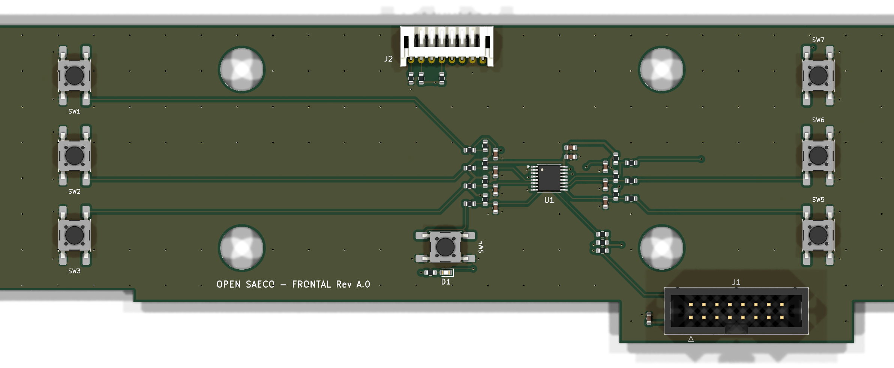

# Layout del frontal Rev A.0

Estado (2026-09-18): **PCB colocada, ruteada y con DRC limpio**, con paquete JLCPCB
candidato en [fabrication/](fabrication/). Pendiente de revisión del propietario y
de las comprobaciones de la última sección: **no pedir todavía**.



La fuente es [tools/layout_front_panel_pcb.py](../../tools/layout_front_panel_pcb.py):
coloca, rutea con Freerouting y rellena masas. No editar la placa a mano sin portar
el cambio al script, igual que con el generador del esquema.

## Teclas, LED y registros del TCA9534

| TCA9534 | Pin | Red | Componente | Posición original | Centro (mm) |
|---|---:|---|---|---|---|
| P0 | 4 | KEY_1_N | SW1 | PB1 | (19,2; 9,9) |
| P1 | 5 | KEY_2_N | SW2 | PB2 | (19,2; 25,6) |
| P2 | 6 | KEY_3_N | SW3 | PB3 | (19,2; 41,2) |
| P3 | 7 | KEY_4_N | SW4 | PB8 (STBY) | (91,7; 43,5) |
| P4 | 9 | KEY_5_N | SW5 | PB4/PB6 | (164,6; 41,2) |
| P5 | 10 | KEY_6_N | SW6 | PB5 | (164,6; 25,6) |
| P6 | 11 | KEY_7_N | SW7 | PB7 | (164,6; 9,9) |
| P7 | 12 | LED_STBY_N | D1 + R7 | DL1 | (91,8; 48,5) |

El orden permite rutear los dos peines sin cruces; el firmware traduce bit → tecla.
Teclas activas a 0 con 10 kΩ a 3,3 V, 1 kΩ serie y 100 nF. El LED (rojo 0603,
KT-0603R) va de 3,3 V por R7 = 470 Ω al pin P7: se enciende con P7 a 0 (≈2,7 mA).
TI SCPS197D: P-port push-pull, ≥8 mA a VOL = 0,5 V y todos los puertos entradas al
arrancar, así que el LED está apagado hasta que el firmware lo configure.

Secuencia para el firmware (sustituye la configuración anterior de ocho entradas):

1. Output (`0x01`) = `0xFF`: P7 alto, LED apagado antes de convertirlo en salida.
2. Polarity (`0x02`) = `0x00`.
3. Configuration (`0x03`) = `0x7F`: P0–P6 entradas, P7 salida.
4. Leer Input (`0x00`) y usar solo los bits 0–6; el bit 7 refleja la salida.
5. LED: bit 7 de Output a 0 = encendido, a 1 = apagado.
6. Tras fallo de bus o reconexión, reescribir en el mismo orden (Output antes que Configuration).

## Colocación

- Pulsadores SW1–SW7 (HRO K2-1102SP-A4SC-04, 6 × 6 × 4,3 mm; el propietario midió
  4,3 mm en el original) centrados en las cotas de [mechanical.md](mechanical.md),
  con las patas arriba/abajo como el original (SW4 girado 90°). Los pads de tecla
  miran hacia U1 y los de masa hacia fuera, cada uno con su vía.
- J1 (IDC 2 × 8) en la pestaña del JP3 original, cara de componentes, pin 1 abajo
  a la izquierda. El propietario confirmó ≥16 mm libres delante de la pestaña.
- J2 (JST PH 8 lateral) arriba al centro, donde estaban JP1/JP2, con la boca hacia
  el borde superior. Orden del cable PH del módulo Waveshare 2": VCC GND DIN CLK CS DC RST BL.
- U1 en el centro (112; 30) con C1/C2 junto a VCC y dos peines RC: P0–P3 a la
  izquierda y P4–P6 a la derecha; R1–R3 (pull-ups I²C/INT) bajo el peine derecho;
  R4–R6 bajo J2; C3 junto al pin 1 de J1.
- Todas las piezas en la cara superior; J1 y J2 son THT.

## Ruteo

Freerouting 2.4.1 rutea desde un DSN exportado por KiCad sin la red GND_UI, que
va por dos rellenos de masa (F.Cu y B.Cu) con vías de cosido cada 7 mm, más una vía
junto a cada pad de masa. Zonas de exclusión de 0,6 mm alrededor de los taladros
Ø8,4. Resultado: 290 segmentos y 182 vías (137 de cosido). F.Cu lleva sobre todo
las líneas de tecla por pasillos rectos; B.Cu lleva el bus SPI y los 3,3 V de J1 a J2
y el I²C de J1 a U1, con el plano de masa inferior entero en la mitad izquierda.

Reglas del proyecto, dentro de la capacidad estándar de JLCPCB para dos capas:
pista y separación de 0,2 mm (Freerouting estrecha a 0,15 mm la entrada a los pines
del TSSOP; mínimo del proyecto 0,15 mm), 3V3_UI en clase Power de 0,4 mm, vías de
0,6/0,3 mm y 0,5 mm de cobre a borde. Los pads GND de J1/J2 van unidos al relleno
sin alivio térmico y los de U1 solo por su pista a la vía.

## Verificación

- ERC nativo: 0 errores y 0 avisos; netlist de KiCad = diseño (42 componentes, 118 pines).
- DRC KiCad 10.0.6 con paridad y todas las severidades: **0 infracciones, 0 conexiones
  pendientes y 0 diferencias con el esquema** ([informe](validation/drc-staging.json)).
- Freerouting informa 32 «violations» internas sin detalle en su registro; la
  referencia es el DRC de KiCad con las reglas del proyecto, que no encuentra ninguna.
- Vistas: [cara superior](preview/pcb-top.png) y [cara inferior](preview/pcb-bottom.png).
  El modelo 3D de los pulsadores es el C&K PTS645 de la biblioteca de KiCad
  (mismo cuerpo 6 × 6 × 4,3 mm), solo como representación.

## Paquete JLCPCB

| Archivo | Contenido |
|---|---|
| [front-panel-reva-gerbers.zip](fabrication/front-panel-reva-gerbers.zip) | Gerber de 2 capas (extensiones Protel, máscara restada de la serigrafía), Excellon en mm y mapa de taladros |
| [front-panel-reva-bom-jlcpcb.csv](fabrication/front-panel-reva-bom-jlcpcb.csv) | 13 líneas / 42 posiciones: Comment, Designator, Footprint, LCSC Part # |
| [front-panel-reva-cpl-jlcpcb.csv](fabrication/front-panel-reva-cpl-jlcpcb.csv) | Designator, Mid X, Mid Y, Layer, Rotation (todas Top) |

Opciones previstas: 2 capas, 1,6 mm (espesor del original sin medir), máscara
verde, acabado a elección. Los taladros Ø8,4 son contorno fresado, no taladros.
Montaje: cara superior; J1 y J2 THT (JLCPCB los monta por soldadura por ola o a mano).

En la vista previa de montaje de JLCPCB comprobar, antes de confirmar:

- U1: pin 1 (arriba a la izquierda de la huella) contra el punto del encapsulado.
- D1: cátodo en el pad 1, el de la derecha, según la marca del LED.
- SW1–SW7: patas arriba/abajo; SW4 girado 90°.
- J1: muesca de polarización del IDC hacia el borde inferior de la pestaña.
- J2: boca del PH hacia el borde superior de la placa.

Las rotaciones del CPL son las de KiCad; si la vista previa muestra una pieza girada,
se corrige allí y se anota aquí.

## Pendiente antes de pedir

- De [mechanical.md](mechanical.md): calibre del alto del cuerpo (54,3), la pestaña
  (62,3) y la separación entre taladros (82,1 × 35,0), y superposición 1:1.
- Función de SP1–SP3 (hoy bajo el relleno de masa, sin pad propio).
- Espesor de la PCB original y holgura real de la carcasa delante de J1 y J2 (4,8 mm de alto).
- Adaptador de pantalla definitivo; J2 está preparado para el cable del módulo Waveshare.
- Stock y precio en el momento del pedido; las cifras del catálogo son del 2026-09-18.

## Regenerar

```sh
python3 tools/generate_front_panel.py
python3 tools/check_front_panel.py
python3 tools/validate_kicad.py
<python de KiCad> tools/sync_front_panel_pcb.py
<python de KiCad> tools/layout_front_panel_pcb.py            # rutea de nuevo
<python de KiCad> tools/layout_front_panel_pcb.py --silk-only # solo textos y modelos
kicad-cli pcb drc --schematic-parity --severity-all --format json -o hardware/front-panel/validation/drc-staging.json hardware/front-panel/kicad/front-panel-reva.kicad_pcb
python3 tools/export_front_panel_fab.py
```

Freerouting no es determinista: cada ruteo nuevo exige repetir DRC y revisión visual.
`FREEROUTING` permite indicar el ejecutable si no está en la ruta por defecto de Windows.
