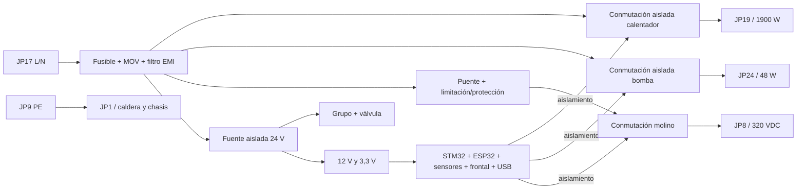

# Arquitectura de alimentación y potencia — principal completa

Estado: arquitectura de integración en curso. La PCB final sustituirá a la
original y contendrá en la misma tarjeta la entrada de 230 V, sus protecciones,
la fuente aislada/transformador, las salidas de red y la electrónica SELV. El
esquema KiCad actual representa todavía solo el subconjunto de baja tensión.

## Dominios obligatorios

| Dominio | Circuitos | Condición de integración |
|---|---|---|
| PE | JP9 de entrada y JP1 hacia caldera/chasis | camino dedicado, corto y dimensionado; no usar como retorno funcional |
| 230 V AC | JP17, filtro/protección, calentador JP19 y bomba JP24 | separado físicamente de SELV y rotulado en ambas caras |
| Bus rectificado | puente y conmutación del molino JP8, ≈325 V pico sin carga | pertenece al dominio peligroso; descarga y medida propias |
| 24 V SELV | motor del grupo y electroválvula | generado por fuente aislada integrada; retorno común de lógica solo después de la barrera |
| 12/3,3 V SELV | lógica, sensores, frontal, USB y depuración | accesible durante pruebas con la máquina alimentada únicamente si el aislamiento está verificado |

La barrera primaria–SELV deberá ser continua en las dos capas. Como regla inicial
de colocación se reservarán 8 mm sin cobre entre ambos dominios y se añadirán
ranuras donde la geometría o los componentes lo requieran. Esta cifra es un
margen de diseño provisional: la liberación exigirá recalcular separación y
creepage según tensión, material, contaminación, categoría de sobretensión y la
norma aplicable al electrodoméstico real.

## Cadena funcional prevista

Las fotos `IMG_1085` a `IMG_1089` muestran que la original usa una fuente
conmutada flyback: puente `DB1`, controlador `U4`, transformador de ferrita `TR1`
y separación por optoacopladores. No es un transformador de red de 50 Hz. Para
Rev A se adopta como candidato el módulo AC/DC aislado encapsulado Mean Well
`IRM-30-24` (`C6280124`), montado en esta misma PCB. Entrega 24 V/1,3 A, ocupa
69,5 × 39 mm y evita desarrollar y homologar un primario flyback a medida.

Los 31 W son suficientes para la corriente resistiva medida del motor de grupo
(unos 0,44 A a 24 V), la lógica y, por separado, la válvula (unos 0,42 A). No se
libera todavía el presupuesto en el caso de arranque, atasco o accionamiento
simultáneo: la selección queda condicionada a medir esos tres casos en la máquina.
J101 y J112 se conservarán durante el desarrollo como entradas de banco o puntos
DNP, con selección que impida realimentar la fuente integrada.

## Cargas conocidas

| Salida | Dato disponible | Implicación de diseño |
|---|---|---|
| Calentador JP19 | 220–230 V AC, 1900 W; resistencia medida 27,5 Ω, 8,4 A a 230 V | conectores, contactos, cobre y corte redundante dimensionados con margen; mantener los dos termostatos externos de 190 °C |
| Bomba JP24 | ULKA EP5/S GW, 220–230 V AC, 48 W, inductiva | conmutador y supresión compatibles con carga inductiva y ciclo 2 min ON / 1 min OFF |
| Molino JP8 | servicio a 320 V DC; bobinado 68 Ω; 1 A de marcha supuesto | BTA24 + KBP410 tras K701, dimensionados para 1 A de marcha y 3,4 A de bloqueo; medir en el prototipo |
| Grupo | 24 V DC; 54,7 Ω medidos | DRV8876 y límite de corriente ya dibujados; alimentar desde 24 V aislados integrados |
| Electroválvula JP3 | OLAB 6000BH/B0DN, 24 V DC; 56,7 Ω | etapa low-side y rueda libre ya dibujadas; alimentar desde 24 V aislados integrados |

## Estado seguro

## Etapa del calentador — diseño propuesto, sin colocar

Con la medida del propietario (2026-09-20) el consumo queda cerrado: 27,5 Ω a
230 V son 8,36 A y 1 924 W, que coincide con los 1 900 W de placa. Ese es el
peor caso de corriente de toda la máquina y es el que ya dimensiona el cobre de
fase duplicado.

Topología propuesta, con los dos medios de corte en serie que exige
[safety.md](../../docs/safety.md):

1. K701, el relé general, corta la fase de todas las cargas y solo se arma con
   reset válido y orden explícita. Ya está en la placa y ruteado.
2. Un triac en la pata de vivo del calentador, disparado por un optotriac de
   paso por cero. El retorno va directo a neutro, ya ruteado hasta la lengüeta 3
   de JP19.

Candidatos, ambos ya en el catálogo con existencias comprobadas el 2026-09-19:

| Pieza | Candidato | Por qué |
|---|---|---|
| Triac | BTA24-800BWRG (C15293) | 25 A y 800 V, TO-220 aislado, 3 cuadrantes |
| Opto | MOC3083 (C10797) | Disparo en paso por cero, 800 V, DIP-6 de 7,62 mm |

**Corregido el 2026-09-22.** Se había supuesto un DIP de 10,16 mm entre filas,
pero C10797 es el MOC3083 normal de Lite-On, de 7,62 mm. La versión ancha es el
MOC3083M, sin existencias en JLC. El opto cruza la barrera sobre una ranura
fresada entre filas: 6,02 mm de aire y unos 9 mm de superficie; ver
[layout.md](../controller/layout.md#barrera-redselv-verificable).

Números que hay que respetar:

| Magnitud | Valor |
|---|---:|
| Corriente de carga | 8,36 A eficaces |
| Disipación estimada del triac | ≈ 8 W |
| Resistencia térmica máxima del disipador | ≈ 5 °C/W |
| Corriente del LED del opto | 10,5 mA desde 12 V con 1 kΩ |
| Pico por la puerta con 390 Ω (R710) | 0,83 A, por debajo del 1 A admisible del opto |

El LED no se ataca desde un GPIO: el MOC3083 garantiza disparo a 5 mA y desde
3,3 V con las resistencias del catálogo no se llega con margen. Se propone el
mismo patrón que ya usan la válvula y el relé, un MOSFET SI2308A gobernado por
la puerta AND libre de U603, cuyo segundo canal está hoy atado a masa y solo
espera esta señal. La resistencia de puerta del triac, en cambio, ve hasta
325 V de pico y ninguna de las resistencias 0603 del catálogo está calificada
para esa tensión. **Resuelto 2026-09-22:** R710 es una Panasonic ERJ-P08J391V
(LCSC C2086379), 1206 antisobretensión de 0,66 W con 500 V de tensión límite de
elemento. Se baja a 390 Ω porque es el valor de la serie con existencias; el
pico de puerta en el peor caso sube a 0,83 A, aún bajo el 1 A del MOC3083.

**Actualización 2026-09-22: colocada y ruteada** con un perfil de 33 × 21 × 35 mm; detalle en [layout.md](../controller/layout.md). Texto original: La reserva del disipador
(x = 55–95, y = 84,5–113 mm) es un área que prohíbe huellas, y tanto los TO-220
como el opto tienen que ir justo ahí: los triacs atornillados al perfil y el
opto cruzando la barrera a su lado. No se puede colocar ninguno sin saber dónde
apoya el disipador elegido y cuánto ocupa su pie. Hasta entonces la etapa queda
especificada pero sin geometría, que es la misma regla que se ha seguido con
JP19 hasta hoy.

## Etapa de la bomba

**Colocada y ruteada el 2026-09-22**, sobre la mitad este del mismo perfil;
detalle en [layout.md](../controller/layout.md#etapa-de-la-bomba-jp24).

Se había previsto un optotriac de disparo aleatorio (VOT8125AG) para no descartar
el control de fase. En JLC no queda ninguno de 800 V en DIP de 400 mil: todas las
variantes VOT8125 y VOT8123 estaban a cero el 2026-09-22, y el C6925370 que
figuraba en el catálogo era un VOT8125AB-T2 SMD. Bajar a 600 V (MOC3052/3053)
contradice la regla de no rebajar el opto. Por decisión del propietario, la
bomba usa el mismo MOC3083 de cruce por cero que el calentador.

Con esta bomba, el cruce por cero no quita nada:

- La ULKA EP5 lleva un diodo en serie con la bobina y solo conduce en un
  semiciclo. Hay que confirmarlo midiendo la muestra.
- La corriente, retrasada respecto a la tensión, se apaga en el diodo. En el
  siguiente semiciclo útil el opto vuelve a disparar en el cero de tensión.
- El caudal se regula saltando semiciclos enteros (PSM), el método habitual con
  estas bombas. La regulación de fase solo sería posible con otro opto.

| Magnitud | Valor |
|---|---:|
| Potencia nominal | 48 W, servicio 2 min ON / 1 min OFF |
| Corriente estimada | ≈ 0,4 A eficaces en semionda, pendiente de medir |
| Disipación del triac | < 0,5 W; el perfil sobra |
| Corriente del LED | 10,5 mA desde 12 V con 1 kΩ (R716), como el calentador |
| Pico por la puerta con 390 Ω (R712) | 0,83 A en el peor caso |

La orden `PUMP_EN_RAW` sale de PB11 y pasa por U604, un tercer SN74LVC2G08, que
la anula mientras `STM_NRST` esté bajo. Su segunda puerta queda atada a masa y
reservada para el molinillo. R713 mantiene la orden a cero en el arranque.

No se pone snubber RC. El BTA24-800BW no lo necesita y, con el diodo en serie,
la corriente llega a cero antes de que el triac tenga que bloquear. Hay que
medir el dV/dt en el apagado con la bomba real antes de liberar la placa. Si
hiciera falta, el snubber va entre A1 y A2 de Q704.

## Etapa del molinillo

**Especificada el 2026-09-23 en el esquema; sin colocar en la PCB.**

La corriente de marcha del motor V3.2 no se ha medido. Por decisión del
propietario, la Rev A supone **1 A de corriente máxima de marcha** y la medirá
en el primer prototipo con los ensayos GR-01 a GR-06 del
[plan de caracterización](../../docs/HD8911/characterization-plan.md). El
bobinado de 68 Ω fija los otros dos casos sin necesidad de medir: en arranque y
bloqueo el motor no genera fuerza contraelectromotriz y la corriente la limita la
resistencia, 230/68 = 3,4 A eficaces (4,8 A de pico).

Topología, la de la original con dos cambios de pieza:

1. Q708, un BTA24-800BW, corta la fase ya armada por K701 (`LOAD_L_ENABLED`).
2. BR701, un puente KBP410, rectifica después del triac. JP8 recibe polaridad
   fija (blanco = +, negro = −) y queda sin tensión en cuanto el triac se abre.
   No hay condensador de bus, así que no hace falta resistencia de descarga.
3. U703, el mismo MOC3083 de cruce por cero que calentador y bomba. El
   molinillo solo se enciende y se apaga, así que el cruce por cero no cuesta
   nada y además arranca el motor con tensión mínima. El VOT8125AG de disparo
   aleatorio sigue sin existencias.
4. R721, la misma ERJ-P08 de 390 Ω en la puerta, y el mismo driver de LED desde
   12 V: Q707 (SI2308A), R718 33 Ω, R719 100 kΩ y R720 1 kΩ.
5. PB12 da la orden `GRINDER_EN_RAW` a la segunda puerta de U604, que la anula
   mientras `STM_NRST` esté bajo. R717 la mantiene a cero en el arranque.

| Magnitud | Valor |
|---|---:|
| Corriente de marcha supuesta | 1 A, pendiente de medir |
| Arranque y bloqueo | 3,4 A eficaces, limitados por los 68 Ω |
| Disipación del triac a 1 A | ≈ 0,8 W; al aire, ≈ +50 K con 60 °C/W |
| Disipación del puente a 1 A | ≈ 1,7 W; +95 K con los 55 °C/W del KBP |
| Disipación del triac en bloqueo | ≈ 2,8 W; aguanta segundos, no minutos |
| Corriente del LED | 10,5 mA desde 12 V con 1 kΩ (R720) |
| Pico por la puerta con 390 Ω (R721) | 0,83 A en el peor caso |

Con 1 A, el triac puede ir al aire, sin disipador, como el BTA208 de la original,
y el disipador compartido se queda para calentador y bomba. El puente aguanta
+95 K solo porque el molido es intermitente, de 3 a 10 s por taza según el
manual. Si la medida supera 1,5 A, o si el ensayo térmico GR-06 da más de 100 °C
en la cápsula del puente, habrá que pasar a un GBU con más superficie o a cuatro
diodos discretos, como la original.

El bloqueo lo tiene que cortar el firmware: 3,4 A no funden F701 (T10A) y el
triac solo lo aguanta unos segundos. Hasta tener medida de corriente, la única
protección es un tiempo máximo de molido y el watchdog. Dos decisiones quedan
abiertas para el propietario:

- **Fusible propio del molinillo.** Un T2A en la rama protegería el puente y el
  triac en bloqueo sin depender del firmware. La zona de red no tiene sitio libre
  para otro portafusibles de 5 × 20, así que habría que usar uno SMD o de
  radial pequeño.
- **Medida de corriente.** El manual la usa para detectar falta de grano
  (corriente baja) y muelas bloqueadas (alta); ver
  [components.md](../../docs/HD8911/components.md#grupo-de-infusión-y-autodosis).
  Exige un sensor con aislamiento reforzado porque el bus está en el lado de red.
  Con 1 A supuestos y 4,8 A de pico en bloqueo, el rango útil es de ±5 A. No se
  añade hasta medir el motor real y ver cuánto se separan las dos corrientes.

No hay snubber RC en Q708 por la misma razón que en la bomba: hay que medir el
dV/dt en el apagado con el motor real (GR-05).

El calentador debe tener dos medios de corte en serie que no dependan de un único
semiconductor ni de un único GPIO. Se añade como candidato un relé general
normalmente abierto Omron `G5RL-1A-E-TV8 DC24` de 16 A delante de las tres ramas
de carga. Cada carga conserva su propio triac y los dos termostatos externos de
190 °C siguen en la cadena del calentador. Bomba y molino arrancarán desactivados
y sus órdenes cruzarán aislamiento. El watchdog existente deberá retirar tanto
la bobina del relé general como las órdenes individuales.

Un semiconductor puede fallar en corto. Por ello el firmware, el watchdog y un
triac/MOSFET apagado no bastan para afirmar desconexión. La selección definitiva
de relé, triacs, optoacopladores, fusibles, MOV, filtro, puente y fuente se hará
con hojas de datos, disponibilidad y proceso de montaje compatibles con JLCPCB o
un ensamblador equivalente.

## Orden de diseño

1. Cotejar con una muestra el patrón de patas de JP1 y JP9. JP19 ya usa la
   huella del TE 1971845-4; JP17, JP24 y JP8 están en sus posiciones originales
   estimadas.
2. Medir corriente de arranque, marcha, bloqueo y simultaneidad para confirmar o
   sustituir la fuente candidata IRM-30-24 ya incorporada al esquema y PCB.
3. Cerrar los valores de fusibles/MOV/filtro y diseñar conmutación del calentador y bomba y
   puente/conmutación del molino.
4. Extender el interlock hardware a las tres salidas peligrosas.
5. Delimitar dominios y reglas de aislamiento en KiCad antes de continuar rutas.
6. Revisar corriente, calentamiento, separación, acceso USB y fallos simples.
7. Generar un primer lote sin autorizar conexión a red hasta superar la revisión
   eléctrica independiente y el plan de puesta en marcha.

## Uso de banco mientras se integra la red

J101 y J112 permiten seguir probando lógica y actuadores de 24 V con fuentes SELV
limitadas. J111 permanece abierto por defecto. El USB puede alimentar solo la
lógica en banco; nunca las cargas. Esta ruta de ensayo no cambia el alcance de la
PCB final y no elimina ninguno de los bloques de potencia anteriores.
