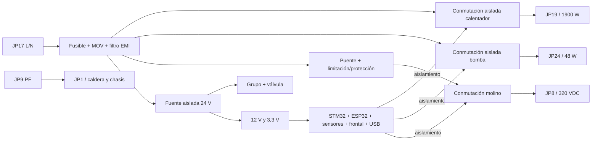

# Arquitectura de alimentación y potencia — principal completa

Estado: arquitectura de integración en curso. La PCB final sustituirá a la
original y contendrá en la misma tarjeta la entrada de 230 V, sus protecciones,
la fuente aislada/transformador, las salidas de red y la electrónica SELV. El
esquema KiCad actual representa todavía solo el subconjunto de baja tensión.

## Dominios obligatorios

| Dominio | Circuitos | Condición de integración |
|---|---|---|
| PE | JP9 de entrada y JP1 hacia caldera/chasis | camino dedicado, corto y dimensionado; no usar como retorno funcional |
| 230 V AC | JP17, filtro/protección, calentador JP19 y bomba JP24 | separado físicamente de SELV y rotulado en ambas caras |
| Bus rectificado | puente y conmutación del molino JP8, ≈325 V pico sin carga | pertenece al dominio peligroso; descarga y medida propias |
| 24 V SELV | motor del grupo y electroválvula | generado por fuente aislada integrada; retorno común de lógica solo después de la barrera |
| 12/3,3 V SELV | lógica, sensores, frontal, USB y depuración | accesible durante pruebas con la máquina alimentada únicamente si el aislamiento está verificado |

La barrera primaria–SELV deberá ser continua en las dos capas. Como regla inicial
de colocación se reservarán 8 mm sin cobre entre ambos dominios y se añadirán
ranuras donde la geometría o los componentes lo requieran. Esta cifra es un
margen de diseño provisional: la liberación exigirá recalcular separación y
creepage según tensión, material, contaminación, categoría de sobretensión y la
norma aplicable al electrodoméstico real.

## Cadena funcional prevista

Las fotos `IMG_1085` a `IMG_1089` muestran que la original usa una fuente
conmutada flyback: puente `DB1`, controlador `U4`, transformador de ferrita `TR1`
y separación por optoacopladores. No es un transformador de red de 50 Hz. Para
Rev A se adopta como candidato el módulo AC/DC aislado encapsulado Mean Well
`IRM-30-24` (`C6280124`), montado en esta misma PCB. Entrega 24 V/1,3 A, ocupa
69,5 × 39 mm y evita desarrollar y homologar un primario flyback a medida.

Los 31 W son suficientes para la corriente resistiva medida del motor de grupo
(unos 0,44 A a 24 V), la lógica y, por separado, la válvula (unos 0,42 A). No se
libera todavía el presupuesto en el caso de arranque, atasco o accionamiento
simultáneo: la selección queda condicionada a medir esos tres casos en la máquina.
J101 y J112 se conservarán durante el desarrollo como entradas de banco o puntos
DNP, con selección que impida realimentar la fuente integrada.

## Cargas conocidas

| Salida | Dato disponible | Implicación de diseño |
|---|---|---|
| Calentador JP19 | 220–230 V AC, 1900 W; 8,26 A a 230 V | conectores, contactos, cobre y corte redundante dimensionados con margen; mantener los dos termostatos externos de 190 °C |
| Bomba JP24 | ULKA EP5/S GW, 220–230 V AC, 48 W, inductiva | conmutador y supresión compatibles con carga inductiva y ciclo 2 min ON / 1 min OFF |
| Molino JP8 | servicio a 320 V DC; bobinado 68 Ω | puente y semiconductor para red rectificada; medir corriente de arranque, marcha y bloqueo antes de fijar protección |
| Grupo | 24 V DC; 54,7 Ω medidos | DRV8876 y límite de corriente ya dibujados; alimentar desde 24 V aislados integrados |
| Electroválvula JP3 | OLAB 6000BH/B0DN, 24 V DC; 56,7 Ω | etapa low-side y rueda libre ya dibujadas; alimentar desde 24 V aislados integrados |

## Estado seguro

El calentador debe tener dos medios de corte en serie que no dependan de un único
semiconductor ni de un único GPIO. Se añade como candidato un relé general
normalmente abierto Omron `G5RL-1A-E-TV8 DC24` de 16 A delante de las tres ramas
de carga. Cada carga conserva su propio triac y los dos termostatos externos de
190 °C siguen en la cadena del calentador. Bomba y molino arrancarán desactivados
y sus órdenes cruzarán aislamiento. El watchdog existente deberá retirar tanto
la bobina del relé general como las órdenes individuales.

Un semiconductor puede fallar en corto. Por ello el firmware, el watchdog y un
triac/MOSFET apagado no bastan para afirmar desconexión. La selección definitiva
de relé, triacs, optoacopladores, fusibles, MOV, filtro, puente y fuente se hará
con hojas de datos, disponibilidad y proceso de montaje compatibles con JLCPCB o
un ensamblador equivalente.

## Orden de diseño

1. Incorporar JP17, JP19, JP24, JP8, JP1 y JP9 al esquema y fijar sus huellas.
2. Elegir la fuente aislada de 24 V y cerrar el presupuesto de potencia/temperatura.
3. Diseñar protección y filtro de entrada, conmutación del calentador y bomba y
   puente/conmutación del molino.
4. Extender el interlock hardware a las tres salidas peligrosas.
5. Delimitar dominios y reglas de aislamiento en KiCad antes de continuar rutas.
6. Revisar corriente, calentamiento, separación, acceso USB y fallos simples.
7. Generar un primer lote sin autorizar conexión a red hasta superar la revisión
   eléctrica independiente y el plan de puesta en marcha.

## Uso de banco mientras se integra la red

J101 y J112 permiten seguir probando lógica y actuadores de 24 V con fuentes SELV
limitadas. J111 permanece abierto por defecto. El USB puede alimentar solo la
lógica en banco; nunca las cargas. Esta ruta de ensayo no cambia el alcance de la
PCB final y no elimina ninguno de los bloques de potencia anteriores.
