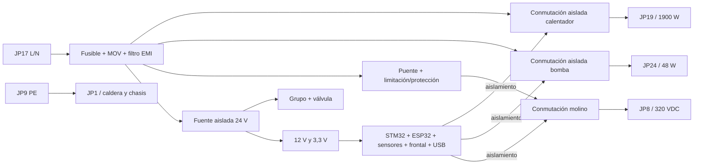

# Arquitectura de alimentación y potencia — principal completa

Estado: integrada en el esquema y en la PCB ruteada, sin ensayar. La placa
sustituye a la original y contiene en la misma tarjeta la entrada de 230 V, sus
protecciones, la fuente aislada, las salidas de red y la electrónica SELV. Falta
el filtro EMI, RV701, el valor de F702 y el margen de carga de F701; el poder de
corte de los tres fusibles de red está fijado (ver
[corriente de defecto supuesta](#corriente-de-defecto-supuesta-y-fusibles-de-red)).

## Dominios obligatorios

| Dominio | Circuitos | Condición de integración |
|---|---|---|
| PE | JP9 de entrada y JP1 hacia caldera/chasis | camino dedicado, corto y dimensionado; no usar como retorno funcional |
| 230 V AC | JP17, filtro/protección, calentador JP19 y bomba JP24 | separado físicamente de SELV y rotulado en ambas caras |
| Bus rectificado | puente y conmutación del molino JP8, ≈325 V pico sin carga | pertenece al dominio peligroso; descarga y medida propias |
| 24 V SELV | motor del grupo y electroválvula | generado por fuente aislada integrada; retorno común de lógica solo después de la barrera |
| 12/3,3 V SELV | lógica, sensores, frontal, USB y depuración | accesible durante pruebas con la máquina alimentada únicamente si el aislamiento está verificado |

La barrera primaria–SELV es continua en las cuatro capas de cobre: una banda de
8 mm sin cobre entre ambos dominios, comprobada por el DRC, con ranuras fresadas
bajo los optotriacs. Esta cifra es un
margen de diseño provisional: la liberación exigirá recalcular separación y
creepage según tensión, material, contaminación, categoría de sobretensión y la
norma aplicable al electrodoméstico real.

## Cadena funcional prevista

```mermaid
flowchart LR
    L[JP17 L/N] --> P[Fusible + MOV + filtro EMI]
    PE[JP9 PE] --> PEO[JP1 / caldera y chasis]
    P --> H[Conmutación aislada calentador]
    H --> JH[JP19 / 1900 W]
    P --> U[Conmutación aislada bomba]
    U --> JP[JP24 / 48 W]
    P --> B[Puente + limitación/protección]
    B --> G[Conmutación molino]
    G --> JG[JP8 / 320 VDC]
    P --> T[Fuente aislada 24 V]
    T --> M[Grupo + válvula]
    T --> D[12 V y 3,3 V]
    D --> C[STM32 + ESP32 + sensores + frontal + USB]
    C -->|aislamiento| H
    C -->|aislamiento| U
    C -->|aislamiento| G
```

Las fotos `IMG_1085` a `IMG_1089` muestran que la original usa una fuente
conmutada flyback: puente `DB1`, controlador `U4`, transformador de ferrita `TR1`
y separación por optoacopladores. No es un transformador de red de 50 Hz. Para
Rev A se adopta como candidato el módulo AC/DC aislado encapsulado Mean Well
`IRM-30-24` (`C6280124`), montado en esta misma PCB. Entrega 24 V/1,3 A, ocupa
69,5 × 39 mm y evita desarrollar y homologar un primario flyback a medida.

Los 31 W son suficientes para la corriente resistiva medida del motor de grupo
(unos 0,44 A a 24 V), la lógica y, por separado, la válvula (unos 0,42 A). No se
libera todavía el presupuesto en el caso de arranque, atasco o accionamiento
simultáneo: la selección queda condicionada a medir esos tres casos en la máquina.
J101 y J112 se conservan como entradas de banco. J121, un puente de soldadura
que se fabrica cerrado, une la salida de PS701 al rail de 24 V y se abre antes de
alimentar por J112. J101 entra a `12V_PROTECTED` por su propio fusible (F305) y
Schottky (D307), en OR con la salida de U303 por F301/D301. Antes compartía nodo
con la salida de U303: alimentado sin 24 V, el nodo SW del AP63200 quedaba por
encima de su VIN, fuera de su máximo absoluto, y su diodo interno devolvía
tensión a `24V_ACT_RAW`. Lo detecta la regla `back-feed` del simulador.

## Cargas conocidas

| Salida | Dato disponible | Implicación de diseño |
|---|---|---|
| Calentador JP19 | 220–230 V AC, 1900 W; resistencia medida 27,5 Ω, 8,4 A a 230 V | conectores, contactos, cobre y corte redundante dimensionados con margen; mantener los dos termostatos externos de 190 °C |
| Bomba JP24 | ULKA EP5/S GW, 220–230 V AC, 48 W, inductiva | conmutador y supresión compatibles con carga inductiva y ciclo 2 min ON / 1 min OFF |
| Molino JP8 | servicio a 320 V DC; bobinado 68 Ω; marcha sin medir | BTA24 + T4A + KBP410 tras K701, dimensionados para 3 A (casi los 3,4 A de bloqueo); medir en el prototipo |
| Grupo | 24 V DC; 54,7 Ω medidos | DRV8876 y límite de corriente ya dibujados; alimentar desde 24 V aislados integrados |
| Electroválvula JP3 | OLAB 6000BH/B0DN, 24 V DC; 56,7 Ω | etapa low-side y rueda libre ya dibujadas; alimentar desde 24 V aislados integrados |

## Etapa del calentador

Con la medida del propietario (2026-09-20) el consumo queda cerrado: 27,5 Ω a
230 V son 8,36 A y 1 924 W, que coincide con los 1 900 W de placa. Ese es el
peor caso de corriente de toda la máquina y es el que ya dimensiona el cobre de
fase duplicado.

Topología propuesta, con los dos medios de corte en serie que exige
[safety.md](../../docs/safety.md):

1. K701, el relé general, corta la fase de todas las cargas y solo se arma con
   reset válido y orden explícita. Ya está en la placa y ruteado.
2. Un triac en la pata de vivo del calentador, disparado por un optotriac de
   paso por cero. El retorno va directo a neutro, ya ruteado hasta la lengüeta 3
   de JP19.

Candidatos, ambos ya en el catálogo con existencias comprobadas el 2026-09-19:

| Pieza | Candidato | Por qué |
|---|---|---|
| Triac | BTA24-800BWRG (C15293) | 25 A y 800 V, TO-220 aislado, 3 cuadrantes |
| Opto | MOC3083 (C10797) | Disparo en paso por cero, 800 V, DIP-6 de 7,62 mm |

**Corregido el 2026-09-22.** Se había supuesto un DIP de 10,16 mm entre filas,
pero C10797 es el MOC3083 normal de Lite-On, de 7,62 mm. La versión ancha es el
MOC3083M, sin existencias en JLC. El opto cruza la barrera sobre una ranura
fresada entre filas: 6,02 mm de aire y unos 9 mm de superficie; ver
[layout.md](../controller/layout.md#barrera-redselv-verificable).

Números que hay que respetar:

| Magnitud | Valor |
|---|---:|
| Corriente de carga | 8,36 A eficaces |
| Disipación estimada del triac | ≈ 8 W |
| Resistencia térmica máxima del disipador | ≈ 5 °C/W |
| Corriente del LED del opto | 10,5 mA desde 12 V con 1 kΩ (9,5–11,5 mA en el peor caso) |
| Potencia en la resistencia del LED | hasta 120 mW: ROHM ESR03EZPF1001, 0603 de 250 mW |
| Pico por la puerta con 390 Ω (R710) | 0,83 A, por debajo del 1 A admisible del opto |

El LED no se ataca desde un GPIO: el MOC3083 garantiza disparo a 5 mA y desde
3,3 V con las resistencias del catálogo no se llega con margen. Se usa el mismo
patrón que el relé: un MOSFET BSS138LT1G (Q705) gobernado por la
segunda puerta AND de U603. La puerta recibe 3,3 V, así que el MOSFET tiene que
estar especificado a esa tensión: el BSS138LT1G garantiza 10 Ω a VGS = 2,75 V
(VGS(th) máx. 1,5 V). El SI2308A que hubo hasta el 2026-10-05 solo está
especificado desde 4,5 V y su VGS(th) llega a 3 V; lo detectó la comprobación de
excitación del simulador. La resistencia de puerta del triac, en cambio, ve hasta
325 V de pico y ninguna de las resistencias 0603 del catálogo está calificada
para esa tensión. **Resuelto 2026-09-22:** R710 es una Panasonic ERJ-P08J391V
(LCSC C2086379), 1206 antisobretensión de 0,66 W con 500 V de tensión límite de
elemento. Se baja a 390 Ω porque es el valor de la serie con existencias; el
pico de puerta en el peor caso sube a 0,83 A, aún bajo el 1 A del MOC3083.

**Actualización 2026-09-22: colocada y ruteada** con un perfil de 33 × 21 × 35 mm; detalle en [layout.md](../controller/layout.md). Texto original: La reserva del disipador
(x = 55–95, y = 84,5–113 mm) es un área que prohíbe huellas, y tanto los TO-220
como el opto tienen que ir justo ahí: los triacs atornillados al perfil y el
opto cruzando la barrera a su lado. No se puede colocar ninguno sin saber dónde
apoya el disipador elegido y cuánto ocupa su pie. Hasta entonces la etapa queda
especificada pero sin geometría, que es la misma regla que se ha seguido con
JP19 hasta hoy.

## Etapa de la bomba

**Colocada y ruteada el 2026-09-22**, sobre la mitad este del mismo perfil;
detalle en [layout.md](../controller/layout.md#etapa-de-la-bomba-jp24).

Se había previsto un optotriac de disparo aleatorio (VOT8125AG) para no descartar
el control de fase. En JLC no queda ninguno de 800 V en DIP de 400 mil: todas las
variantes VOT8125 y VOT8123 estaban a cero el 2026-09-22, y el C6925370 que
figuraba en el catálogo era un VOT8125AB-T2 SMD. Bajar a 600 V (MOC3052/3053)
contradice la regla de no rebajar el opto. Por decisión del propietario, la
bomba usa el mismo MOC3083 de cruce por cero que el calentador.

Con esta bomba, el cruce por cero no quita nada:

- La ULKA EP5 lleva un diodo en serie con la bobina y solo conduce en un
  semiciclo. Hay que confirmarlo midiendo la muestra.
- La corriente, retrasada respecto a la tensión, se apaga en el diodo. En el
  siguiente semiciclo útil el opto vuelve a disparar en el cero de tensión.
- El caudal se regula saltando semiciclos enteros (PSM), el método habitual con
  estas bombas. La regulación de fase solo sería posible con otro opto.

| Magnitud | Valor |
|---|---:|
| Potencia nominal | 48 W, servicio 2 min ON / 1 min OFF |
| Corriente estimada | ≈ 0,4 A eficaces en semionda, pendiente de medir |
| Disipación del triac | < 0,5 W; el perfil sobra |
| Corriente del LED | 10,5 mA desde 12 V con 1 kΩ (R716), como el calentador |
| Pico por la puerta con 390 Ω (R712) | 0,83 A en el peor caso |

La orden `PUMP_EN_RAW` sale de PB11 y pasa por U604, un tercer SN74LVC2G08, que
la anula mientras `STM_NRST` esté bajo. Su segunda puerta sirve al molinillo.
R713 mantiene la orden a cero en el arranque.

No se pone snubber RC. El BTA24-800BW no lo necesita y, con el diodo en serie,
la corriente llega a cero antes de que el triac tenga que bloquear. Hay que
medir el dV/dt en el apagado con la bomba real antes de liberar la placa. Si
hiciera falta, el snubber va entre A1 y A2 de Q704.

## Etapa del molinillo

**Especificada el 2026-09-23; colocada y ruteada el mismo día**, con Q708 en el
disipador y un fusible propio; detalle en
[layout.md](../controller/layout.md#etapa-del-molinillo-jp8). **Redimensionada a
3 A el mismo día**, a propuesta del propietario.

La corriente de marcha del motor V3.2 no se ha medido; se medirá en el primer
prototipo con los ensayos GR-01 a GR-06 del
[plan de caracterización](../../docs/HD8911/characterization-plan.md). El
bobinado de 68 Ω fija el caso peor sin necesidad de medir: en arranque y
bloqueo el motor no genera fuerza contraelectromotriz y la corriente la limita la
resistencia, 230/68 = 3,4 A eficaces (4,8 A de pico).

La etapa se dimensiona para **3 A**. No es una corriente de marcha creíble: con
68 Ω, 3 A disiparían unos 610 W en el cobre del bobinado, y la marcha real
quedará muy por debajo. Es una envolvente que casi coincide con el bloqueo, de
modo que ningún componente depende ya de la medida: fusible, triac, pistas y
reparto con el calentador valen para cualquier corriente de marcha posible. La
única pieza que no aguanta 3 A en continuo es el puente (ver abajo).

Topología, la de la original con dos cambios de pieza:

1. Q708, un BTA24-800BW, corta la fase ya armada por K701 (`LOAD_L_ENABLED`).
   Va en el mismo perfil que calentador y bomba, en el extremo oeste.
2. F703, un fusible T4A de acción retardada entre el triac y el puente. El
   fusible propio es decisión del propietario; pasó de T2A a T4A con el cambio a
   3 A. Desde el 2026-10-06 es un Littelfuse 0215004.MXEP (C178840), 5 × 20 mm
   cerámico de 1500 A a 250 VAC, montado de pie junto a Q708: el JDT
   JFC2410-1400TS que había solo cortaba 50 A (issue #1).
3. BR701, un puente KBP410, rectifica después del fusible. JP8 recibe polaridad
   fija (blanco = +, negro = −) y queda sin tensión en cuanto el triac se abre.
   No hay condensador de bus, así que no hace falta resistencia de descarga.
4. U703, el mismo MOC3083 de cruce por cero que calentador y bomba. El
   molinillo solo se enciende y se apaga, así que el cruce por cero no cuesta
   nada y además arranca el motor con tensión mínima. El VOT8125AG de disparo
   aleatorio sigue sin existencias.
5. R721, la misma ERJ-P08 de 390 Ω en la puerta, y el mismo driver de LED desde
   12 V: Q707 (BSS138LT1G), R718 33 Ω, R719 100 kΩ y R720 1 kΩ.
6. PC4 da la orden `GRINDER_EN_RAW` a la segunda puerta de U604, que la anula
   mientras `STM_NRST` esté bajo. R717 la mantiene a cero en el arranque.

| Magnitud | Valor |
|---|---:|
| Corriente de diseño | 3 A; la marcha real está pendiente de medir |
| Arranque y bloqueo | 3,4 A eficaces, limitados por los 68 Ω |
| Disipación del triac a 3 A | ≈ 2,5 W, en el perfil compartido |
| Disipación del puente a 3 A | ≈ 5 W; con 55 °C/W no vale en continuo |
| F703 a 3 A | 75 % de su valor; no funde |
| F703 a 3,4 A (bloqueo) | 85 %; no funde nunca |
| Pistas del molinillo | 1,9 mm hasta F703 y 1,2 mm después: ≈ 12 K a 3 A (IPC-2221, 1 oz) |
| Corriente del LED | 10,5 mA desde 12 V con 1 kΩ (R720) |
| Pico por la puerta con 390 Ω (R721) | 0,83 A en el peor caso |

Con poca corriente el triac podría ir al aire, como el BTA208 de la original,
pero en la zona de red no quedaba sitio para un TO-220 de pie y su puente. En
el perfil cabe con 0,6 mm entre courtyards y aguanta 3 A o un bloqueo sin
problema.

El puente es el límite. A 3 A disipa unos 5 W y con los 55 °C/W del KBP410 no
aguanta en continuo; por su masa térmica (≈ 1 J/K, estimación) sube unos
30–50 K en un molido de 10 s y necesita una pausa antes del siguiente. Por eso
el firmware limita cada molido a `OSC_GRINDER_MAX_ON_MS` (10 s). Un GBU no
cabe: pide unos 22 mm de largo y entre la banda de barrera y JP19 hay unos
16,7 mm. Si la marcha medida supera 1,5 A, o si el ensayo térmico GR-06 da más
de 100 °C en la cápsula, el puente pasa a cuatro diodos discretos, como en la
original.

El bloqueo lo sigue cortando el firmware. Con 3,4 A no funden ni F701 (T10A) ni
F703 (T4A). F703 está para un puente o un bobinado en corto: un diodo del
puente en corto, con Q708 conduciendo, cierra un camino de baja impedancia
entre fase y neutro en uno de los semiciclos, y F703, el fusible más pequeño de
ese lazo, es el que tiene que interrumpirlo. Hasta el 2026-10-06 era un
JFC2410 de 50 A de poder de corte y este texto decía que F701 seguía siendo la
protección principal; no lo es para este fallo. Lo que está y no está
demostrado se resume en
[corriente de defecto supuesta](#corriente-de-defecto-supuesta-y-fusibles-de-red).

### Corriente del molinillo

**Añadida el 2026-10-06, a petición del propietario.** El manual la usa para
detectar falta de grano (corriente baja) y muelas bloqueadas (alta); ver
[components.md](../../docs/HD8911/components.md#grupo-de-infusión-y-autodosis).
Con F703 a 4 A es además la única forma de cortar un bloqueo antes del tiempo
máximo de molido.

- U704, un TI TMCS1133B4AQDVGR (C36873216, Extended; 163 en stock el
  2026-10-06; alternativa TMCS1123B4AQDVGR, misma cápsula), Hall con
  aislamiento reforzado de 5 kVrms (UL 1577, IEC 62368-1), en la línea + de
  JP8: IN+ desde el + de BR701 e IN- hacia JP8.1 (`GRINDER_DC_SENSED`). Su
  conductor de 0,7 mΩ disipa 6 mW a 3 A.
- 100 mV/A sobre VS/2 con VS = 3V3_CORE, lineal hasta ±15,5 A: 0–4,8 A (pico
  de bloqueo) dan 1,65–2,13 V, 8,1 mA/LSB. VS es también la VDDA del ADC, así
  que el cero sigue a la tensión de referencia.
- Cruza la barrera como los optos: la huella usa el patrón HV del plano TI
  (`OpenSaeco:TI_DVG0010A_SOIC-10W_HV`), 8,1 mm de aire y de fuga entre las
  dos filas, que cumple la regla de 8 mm sin ranura.
- OC y ALERT a masa y VOC a VS: el comparador de sobrecorriente no se usa.
- La salida va a PA6 (ADC2_IN3) por R412 (1 kΩ) y C407 (100 nF) junto al
  STM32: paso bajo de 1,6 kHz. La corriente es una onda rectificada de
  100 Hz; el firmware muestrea cada milisegundo y promedia periodos enteros.
- El firmware toma el cero con el motor parado, ignora 300 ms de arranque y
  juzga bloques de 100 ms: bloqueo por encima de 2 A; falta de grano por
  debajo de 550 mA o del 75 % de la corriente con carga de los primeros
  bloques, dos bloques seguidos. Umbrales SUPUESTOS hasta GR-02, GR-03 y
  GR-08.

Como respaldo, la prueba de dosis mira la corriente del grupo al prensar
(IPROPI, ya en la placa): con café en la cámara sube sobre I0 (manual: +55 a
200 mA); sin café apenas cambia. Detecta también un conducto tapado.

No hay snubber RC en Q708 por la misma razón que en la bomba: hay que medir el
dV/dt en el apagado con el motor real (GR-05).

## Reparto de corriente en la fase de cargas

Todas las cargas de red pasan por F701 (T10A), K701 y JP17. JP17 es un TE
1971845-3 de 16 A por contacto, así que el límite lo pone F701. En el peor caso
suman 8,4 A del calentador, 3 A del
molinillo y unos 0,2 A de la bomba: 11,6 A. Por eso, desde el 2026-09-23 el
firmware aplica una regla de reparto:

- Mientras el molinillo está encendido, el calentador conduce como máximo
  **3 ciclos completos de red de cada 5** (60 %). Su corriente eficaz baja a
  8,4 × √0,6 ≈ 6,5 A, y el total queda en unos 9,7 A, por debajo de F701.
- Se cuentan ciclos completos, no semiciclos, para no meter componente continua
  en la red. Los MOC3083 de cruce por cero ya conmutan así.
- Un molido dura como máximo 10 s, así que el calentador pierde como mucho 4 s
  de potencia plena por taza. La inercia de la caldera lo absorbe.

Las constantes están en `firmware/stm32/include/controller.h`
(`OSC_HEATER_CYCLES_WHILE_GRINDING`, `OSC_HEATER_WINDOW_CYCLES`,
`OSC_GRINDER_MAX_ON_MS`) y `osc_heater_cycles_allowed()` tiene su prueba en
CTest. El núcleo todavía no conmuta cargas: la regla queda fijada para cuando
exista el control del calentador. No sustituye a F701: es una regla de
dimensionado, y un fallo del firmware que la incumpla solo sobrecarga F701 un
110–120 % durante los segundos de un molido.

## Corriente de defecto supuesta y fusibles de red

**Desde el 2026-10-06** (issue #1). En un cortocircuito el fusible con menos
I²t de fusión del lazo abre primero y tiene que interrumpir solo la corriente;
otro fusible aguas arriba no le ayuda a cortarla. Por eso cada fusible de red
necesita su propio poder de corte, al menos la corriente de defecto prevista en
el punto de instalación.

**Hipótesis de diseño: 1500 A a 250 VAC.** Es el nivel de alto poder de corte
(«H») de IEC 60127-2, no un máximo medido ni normalizado para la instalación.
No se deriva del circuito: de las resistencias del lazo solo se conocen las de
los fusibles (6,6 mΩ de F701 y 18,5 mΩ de F703 en frío, hoja Littelfuse 215);
el cable de la máquina, la instalación y el cobre de la placa no se han medido.
Queda en `mains.prospective_fault` del contrato
(`firmware/common/signals.json`) y debe confirmarse en la revisión de seguridad
con el mercado de destino.

| Fusible | Pieza | Poder de corte | I²t de fusión nominal (10 In) |
|---|---|---:|---:|
| F701, entrada | Littelfuse 0215010.MXP (C142733), T10AH, en dos pinzas 01110501Z | 1500 A a 250 VAC | 333,6 A²s |
| F702, fuente | Littelfuse 0215001.MXP (C142715), T1AH, en dos pinzas 01110501Z | 1500 A a 250 VAC | 1,52 A²s |
| F703, molinillo | Littelfuse 0215004.MXEP (C178840), T4AH axial, de pie | 1500 A a 250 VAC | 46,96 A²s |

Fuente: Littelfuse 215 Series (revisión 01/12/17), *Electrical Characteristic
Specifications by Item*: 1500 A a 250 VAC de 0,125 a 12 A. F702 se cambia por
la misma razón que F703: un fallo en la entrada de PS701 es un cortocircuito de
red tras el fusible más pequeño de su lazo. La regla `fuse-breaking` del modelo
de placa recorre fase y neutro a través de fusibles, contactos, triacs, puentes
y el conductor de U704 y falla si un fusible de ese lado no corta la corriente
supuesta o no tiene el dato en `sim/reference/devices.json`.

Se separan dos requisitos, como pide la revisión de la issue:

1. **Despejar el fallo sin peligro.** Los tres fusibles tienen el poder de corte
   supuesto. Queda validar la interrupción con medios adecuados, no solo con la
   hoja de datos.
2. **Que el puente y el triac sobrevivan.** No está demostrado. El I²t de
   fusión nominal de F703 (46,96 A²s, medido a 10 In) ya supera los 35 A²s del
   KBP410 (MDD, rev. 2024A3, para 3–8,3 ms), y el de despeje es mayor. Un
   cortocircuito en el lado de continua (JP8 o el motor) puede destruir el
   puente antes de que abra F703; el fallo pasa entonces a ser el de fase a
   neutro del punto 1. Para el BTA24 (340 A²s a 10 ms, ST DS2112) el dato de
   fusión queda por debajo, pero Littelfuse no publica el I²t de despeje a
   esas corrientes, así que tampoco está demostrado.

**Selectividad con F701.** El cociente de los I²t de fusión nominales es 7,1
(333,6 frente a 46,96 A²s), pero solo a 10 In. Para que F703 abra sin fundir
F701 hace falta que su I²t total de despeje a la corriente de fallo quede por
debajo del I²t de prearco de F701 a esa misma corriente, y ese dato no está
publicado. La selectividad queda sin demostrar y se retira la afirmación de
que F703 despeja un corto «sin llevarse por delante la máquina entera».

**F702.** Su valor de 1 A sigue provisional: tiene que aguantar sin envejecer
la irrupción del IRM-30 en frío (45 A típicos a 230 VAC, hoja Mean Well), cuyo
I²t de pulso falta por medir (PS-03).

**Margen de carga de F701, abierto.** Las pinzas Littelfuse 111 501 están
indicadas «para corrientes de hasta 10 A» (catálogo de clips Littelfuse) y el
fusible es de 10 A, con un 95 % aproximado a 60 °C según la curva de la hoja.
Solo el calentador consume 8,4 A a 230 V y 9,2 A a 253 V; con el reparto de
molido el total ronda 9,7 A a 230 V. El propietario debe decidir el margen
(otras pinzas y un fusible mayor de la misma serie, o un límite de carga).

**Montaje de F703.** El JFC2410 no se podía cambiar por un 5 × 20 mm en
horizontal: al sur de Q708 solo quedaban 4,6 mm. El 0215004.MXEP va de pie con
el cuerpo sobre el pad 1, bajo Q708.1, y la patilla lejana doblada hasta el
pad 2, a 5,08 mm. Littelfuse pide al menos 1,5 mm entre placa y casquillo y el
doblez a más de 1,0 mm del casquillo; la patilla de vuelta va enfundada. Mide
unos 25 mm de alto, menos que el perfil de 35 mm, y se suelda a mano o por ola
(la hoja lo excluye del reflujo). Para hacerle sitio, J115 (JP8) baja 1,35 mm,
hacia la posición fotografiada y dentro de los ±1,5 mm asignados, BR701 baja
1,2 mm y la puerta de la bomba pasa a y = 117,2 mm. El propietario confirmó el
2026-10-06 que el mazo de JP8 llega de sobra en la nueva posición.

**Lo que dice la placa original** ([fotos](../../docs/HD8911/photos.md#fusibles-y-puente-del-molinillo-2026-10-06)).
Sus dos fusibles de red, F1 y F2, son 5 × 20 mm cerámicos de clase H (se lee
«…H250» en F1 y casi seguro T2AH250V en F2), así que la hipótesis de 1500 A
coincide con la clase que eligió el fabricante; no mide la corriente prospectiva.
No tenía fusible propio del molinillo, y su puente eran cuatro 1N400x de 1 A, que
ningún fusible de red podía proteger de un corto en continua: aceptaba sacrificar
el puente y despejar con F1, lo mismo que se acepta en el requisito 2.

**Para cerrar la issue** faltan: confirmar la hipótesis de 1500 A en la
revisión de seguridad (con el precedente de la original), aceptar por escrito
que el requisito 2 no se cumple, como en la original, el valor de F702 (PS-03),
el margen de F701 (con el amperaje de F1 de la original como referencia) y el
ensayo de interrupción de la rama del molinillo con una fuente de corriente
prospectiva conocida (PS-04).

## Estado seguro

El calentador tiene dos medios de corte en serie que no dependen de un único
semiconductor ni de un único GPIO: el relé general normalmente abierto Omron
`G5RL-1A-E-TV8 DC24` de 16 A, delante de las tres ramas de carga, y su propio
triac. Los dos termostatos externos de 190 °C siguen en la cadena del
calentador. Bomba y molino arrancan desactivados y sus órdenes cruzan la barrera
por optotriacs. Con el MCU en reset, U603 y U604 retiran tanto la bobina del
relé general como las órdenes individuales.

Un semiconductor puede fallar en corto. Por ello el firmware, el watchdog y un
triac/MOSFET apagado no bastan para afirmar desconexión. La selección definitiva
de relé, triacs, optoacopladores, fusibles, MOV, filtro, puente y fuente se hará
con hojas de datos, disponibilidad y proceso de montaje compatibles con JLCPCB o
un ensamblador equivalente.

## Lo que queda

Ya están hechos las etapas de las tres cargas de red, el interlock sobre todas
ellas, las reglas de aislamiento en KiCad y el ruteo. Queda:

1. Comprobar en la impresión 1:1 las huellas de JP1/JP9 (TE 63824-1), JP17 y
   JP19 (TE RAST 5), JP8 y JP24 (LEOCO) y la orientación de sus carcasas.
2. Medir corriente de arranque, marcha, bloqueo y simultaneidad para confirmar o
   sustituir la IRM-30-24.
3. Cerrar RV701, el filtro EMI, el valor de F702, el margen de carga de F701 y
   el ensayo de interrupción de los fusibles de red.
4. Revisar corriente, calentamiento, separación, acceso USB y fallos simples.
5. Generar un primer lote sin autorizar conexión a red hasta superar la revisión
   eléctrica independiente y el plan de puesta en marcha.

## Uso de banco

J101 y J112 permiten seguir probando lógica y actuadores de 24 V con fuentes SELV
limitadas. J111 permanece abierto por defecto. El USB puede alimentar solo la
lógica en banco; nunca las cargas. Esta ruta de ensayo no cambia el alcance de la
PCB final y no elimina ninguno de los bloques de potencia anteriores.
